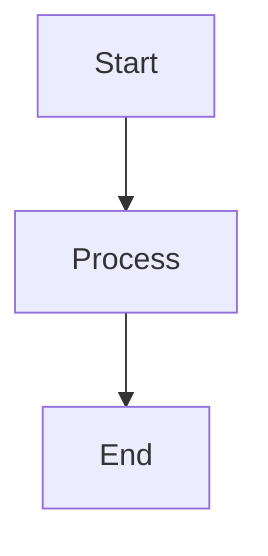

# C++ Advanced Library Documentation

Umfassende Dokumentation für die C++ Advanced Library, erstellt mit MkDocs Material.

## Überblick

Diese Dokumentation demonstriert Best Practices für die Dokumentation von C++-Projekten mit MkDocs:

- **Umfangreiche Struktur**: Getting Started, Tutorials, API Reference, Architecture, Examples
- **Multiple Themes**: Einfach zwischen verschiedenen MkDocs Themes wechseln
- **Code-Beispiele**: Vollständige, lauffähige C++-Beispiele
- **Interaktive Features**: Tabs, Admonitions, Mermaid Diagramme
- **Deutsche Lokalisierung**: Vollständig auf Deutsch

## Features

- ✨ Material Design Theme (konfigurierbar)
- 🎨 Hell/Dunkel Modus
- 🔍 Volltext-Suche
- 📱 Responsive Design
- 🚀 Schnelle Navigation
- 📖 Umfangreiche Code-Beispiele
- 📊 Mermaid Diagramme
- 🏷️ Tags und Kategorien
- 🔨 Build Control Hook - Pausiere HTML-Builds vom Browser aus
- ✏️ Live Edit - Bearbeite Seiten direkt im Browser

## Voraussetzungen

- Python 3.10+ (erforderlich für Live Edit Plugin)
- pip

## Installation

### 1. Repository klonen

```bash
git clone <your-repo-url>
cd mkdocs
```

### 2. Python-Abhängigkeiten installieren

```bash
pip install -r requirements.txt
```

### 3. MkDocs starten

Für **Live Edit Funktionalität** (erforderlich für Browser-Bearbeitung):

```bash
mkdocs serve -a 0.0.0.0:8000
```

Die Dokumentation ist dann verfügbar unter: http://127.0.0.1:8000

**Hinweis**: Das `-a 0.0.0.0:8000` Flag ist notwendig, damit das Live Edit Plugin korrekt funktioniert.

## Projekt-Struktur

```
mkdocs/
├── mkdocs.yml              # Hauptkonfiguration
├── requirements.txt        # Python-Abhängigkeiten
├── README.md              # Dieses File
├── docs/                  # Dokumentations-Markdown-Dateien
│   ├── index.md          # Startseite
│   ├── getting-started/  # Getting Started Guide
│   ├── tutorials/        # Tutorial-Seiten
│   ├── api-reference/    # API-Dokumentation
│   ├── architecture/     # Architektur-Docs
│   ├── examples/         # Beispiele
│   ├── development/      # Development Guide
│   ├── about/           # Über, Lizenz, etc.
│   └── assets/          # CSS, JS, Bilder
└── examples/            # C++ Beispiel-Code
    ├── basic/          # Basis-Beispiele
    └── advanced/       # Fortgeschrittene Beispiele
```

## Theme wechseln

Um zwischen verschiedenen Themes zu wechseln, bearbeite `mkdocs.yml`:

### Material Theme (Standard)

```yaml
theme:
  name: material
  # ... Material-spezifische Optionen
```

### ReadTheDocs Theme

Kommentiere Material Theme aus und aktiviere:

```yaml
theme:
  name: readthedocs
```

### MkDocs Default Theme

```yaml
theme:
  name: mkdocs
```

### Andere Themes

Siehe [MkDocs Themes](https://github.com/mkdocs/mkdocs/wiki/MkDocs-Themes) für weitere Optionen.

## Build für Production

### Statische Site generieren

```bash
mkdocs build
```

Die fertige Site wird in `site/` generiert.

### Build mit strikten Checks

```bash
mkdocs build --strict
```

### Site deployen

GitHub Pages:

```bash
mkdocs gh-deploy
```

Andere Hosting-Optionen siehe [MkDocs Deployment](https://www.mkdocs.org/user-guide/deploying-your-docs/).

## Konfiguration

### Haupt-Features aktivieren/deaktivieren

In `mkdocs.yml`:

```yaml
# Plugins
plugins:
  - search          # Suche aktivieren
  - tags           # Tags aktivieren
  - git-revision-date-localized  # Git-Datums-Stamping

# Extensions
markdown_extensions:
  - admonition     # Info-Boxen
  - pymdownx.highlight  # Code-Highlighting
  - pymdownx.superfences  # Code-Blöcke mit Tabs
```

### Navigation anpassen

Die Navigation ist in `mkdocs.yml` unter `nav:` definiert:

```yaml
nav:
  - Home: index.md
  - Getting Started:
    - getting-started/index.md
    - Installation: getting-started/installation.md
  # ...
```

## Dokumentation schreiben

### Neue Seite hinzufügen

1. Erstelle Markdown-Datei in `docs/`:

```bash
touch docs/my-new-page.md
```

2. Füge zur Navigation in `mkdocs.yml` hinzu:

```yaml
nav:
  - My New Page: my-new-page.md
```

### Code-Beispiele

Mit Syntax-Highlighting:

````markdown
```cpp
#include <iostream>

int main() {
    std::cout << "Hello, World!" << std::endl;
    return 0;
}
```
````

### Admonitions (Info-Boxen)

```markdown
!!! note "Notiz"
    Dies ist eine wichtige Notiz.

!!! warning "Warnung"
    Achtung, hier ist Vorsicht geboten!

!!! tip "Tipp"
    Hier ist ein hilfreicher Tipp.
```

### Tabs

```markdown
=== "Linux"

    ```bash
    sudo apt install package
    ```

=== "macOS"

    ```bash
    brew install package
    ```

=== "Windows"

    ```powershell
    choco install package
    ```
```

### Mermaid Diagramme

```markdown

```

## Live Edit Plugin

Das **mkdocs-live-edit-plugin** ermöglicht es, Markdown-Seiten direkt im Browser zu bearbeiten - kein Editor erforderlich!

### Features

- ✏️ **Bearbeiten**: Editiere Markdown direkt im Browser
- 📄 **Erstellen**: Neue Seiten mit einem Klick anlegen
- ✂️ **Löschen**: Seiten direkt aus dem Browser entfernen
- 🔄 **Umbenennen**: Seiten und Dateien umbenennen
- 💾 **Auto-Save**: Änderungen werden sofort gespeichert
- 🔥 **Live-Reload**: MkDocs lädt die Seite automatisch neu

### Verwendung

1. **MkDocs mit korrektem Host starten**:

```bash
mkdocs serve -a 0.0.0.0:8000
```

2. **Im Browser**: Navigiere zu einer Seite
3. **Edit-Button**: Klicke auf den Edit-Button (erscheint automatisch)
4. **Bearbeiten**: Editiere den Markdown-Inhalt
5. **Speichern**: Drücke `Ctrl+S` (Windows/Linux) oder `Cmd+S` (Mac)

### Tastenkombinationen

- `Ctrl/Cmd + S` - Änderungen speichern
- `Ctrl/Cmd + B` - Text fett formatieren
- `Ctrl/Cmd + I` - Text kursiv formatieren
- `Alt/Opt + S` - Text durchstreichen

### Konfiguration

In `mkdocs.yml`:

```yaml
plugins:
  - live-edit:
      websockets_port: 9001  # WebSocket Port (default: 9001)
      debug_mode: false      # Debug-Modus für Browser-Console
```

### Wichtige Hinweise

- **WebSocket-Server**: Läuft auf Port 9001 (konfigurierbar)
- **Bind-Adresse**: MkDocs muss mit `-a 0.0.0.0:8000` gestartet werden
- **Python-Version**: Mindestens Python 3.10 erforderlich

## Build Control Hook

Das Projekt enthält ein Build Control System, das es ermöglicht, den HTML-Build vom Browser aus zu pausieren, während die LLM-Dokumentations-Generierung im Hintergrund weiterläuft.

### Verwendung

1. **Control Server starten** (in einem separaten Terminal):

```bash
python mkdocs_build_control.py
```

Der Server läuft auf http://localhost:8001

2. **MkDocs starten**:

```bash
mkdocs serve
```

3. **Im Browser**: Klicke auf den Build-Toggle-Button (🔨) oben rechts

### Funktionsweise

- **Build aktiv (🟢)**: HTML-Dateien werden bei Änderungen neu gebaut
- **Build pausiert (🟡)**: HTML-Build ist deaktiviert, LLM-Generierung läuft weiter

Der Hook prüft vor jedem Build die Existenz der Datei `.mkdocs-build-paused`:
- Wenn vorhanden → Build wird übersprungen
- Wenn nicht vorhanden → Normaler Build

### Dateien

- `hooks/build_control.py` - MkDocs Hook, der den Build pausiert
- `mkdocs_build_control.py` - HTTP-Server für Browser-Control
- `docs/assets/extra.js` - Browser Toggle-Button
- `docs/assets/extra.css` - Styling für Toggle-Button

## Entwicklung

### Live-Reload während der Entwicklung

```bash
mkdocs serve --dev-addr 0.0.0.0:8000
```

### Lokale Suche testen

```bash
mkdocs serve
```

Die Suche funktioniert nur im `serve` oder `build` Modus.

## Nützliche Befehle

```bash
# Entwicklungsserver starten (mit Live Edit Support)
mkdocs serve -a 0.0.0.0:8000

# Entwicklungsserver starten (Standard, ohne Live Edit)
mkdocs serve

# Production Build
mkdocs build

# Build mit strict mode (bricht bei Warnungen ab)
mkdocs build --strict

# Deploy zu GitHub Pages
mkdocs gh-deploy

# Hilfe anzeigen
mkdocs --help

# Version anzeigen
mkdocs --version
```

## Troubleshooting

### Fehler: "Module not found"

```bash
pip install -r requirements.txt --upgrade
```

### Fehler: Port bereits in Verwendung

```bash
mkdocs serve --dev-addr 127.0.0.1:8001
```

### Theme lädt nicht

Prüfe `mkdocs.yml` auf Syntax-Fehler:

```bash
mkdocs build --strict --verbose
```

### Suche funktioniert nicht

Stelle sicher, dass das `search` Plugin aktiviert ist:

```yaml
plugins:
  - search
```

## Best Practices

1. **Verwende aussagekräftige Titel**: Jede Seite sollte einen klaren H1-Titel haben
2. **Strukturiere mit Headings**: Nutze H2, H3 für Hierarchie
3. **Code-Beispiele**: Alle Code-Beispiele sollten lauffähig sein
4. **Interne Links**: Nutze relative Links für Navigation
5. **Bilder**: Lege Bilder in `docs/assets/images/` ab
6. **Versionierung**: Tagge Releases mit Git-Tags

## Weitere Ressourcen

- [MkDocs Dokumentation](https://www.mkdocs.org/)
- [Material for MkDocs](https://squidfunk.github.io/mkdocs-material/)
- [PyMdown Extensions](https://facelessuser.github.io/pymdown-extensions/)
- [Mermaid Diagramme](https://mermaid.js.org/)

## Lizenz

Diese Dokumentation ist unter der MIT Lizenz verfügbar.

## Contributing

Beiträge sind willkommen! Siehe CONTRIBUTING.md für Details.

## Support

- Issues: [GitHub Issues](https://github.com/youruser/advlib/issues)
- Diskussionen: [GitHub Discussions](https://github.com/youruser/advlib/discussions)
- Discord: [Community Server](https://discord.gg/advlib)
