# Components

Detailed overview of the library's major components and their interactions.

## Overview

This document describes the major components of the library and how they work together.

## Component Architecture

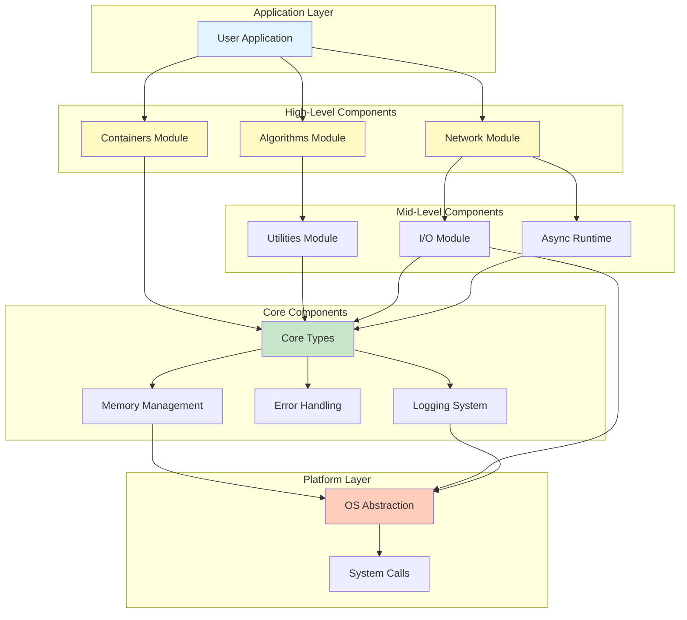

## Core Components

### Core Types Module

The foundation of all library functionality providing essential types.

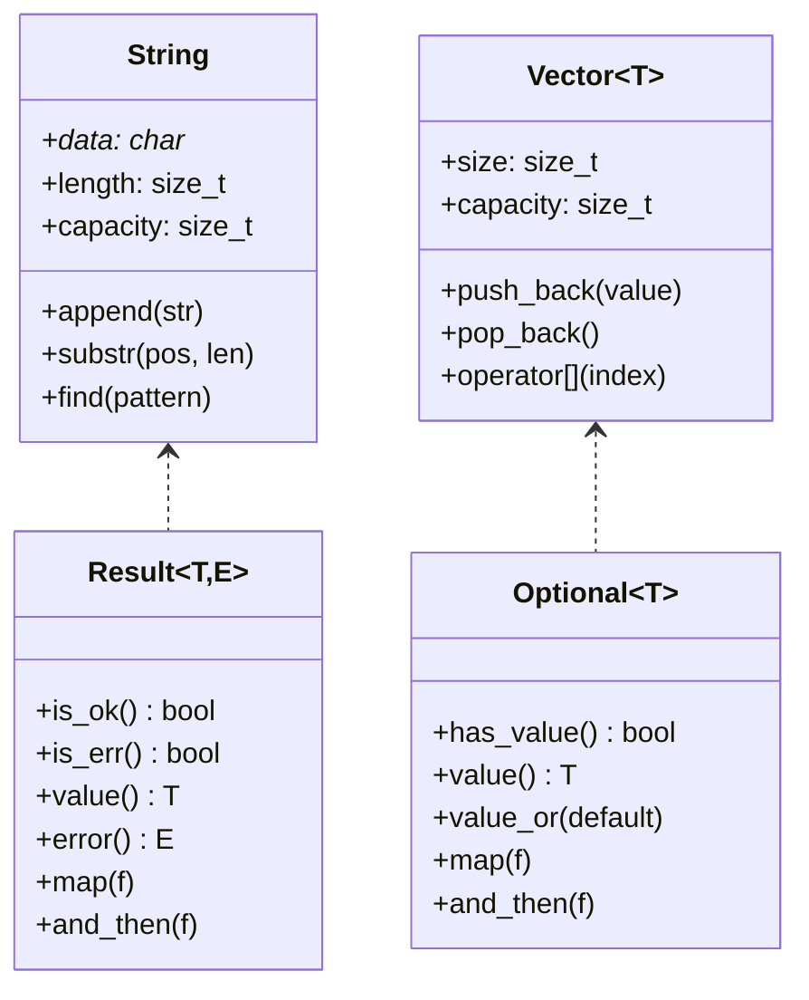

**Responsibilities:**
- Fundamental data types (String, Result, Optional)
- Type-safe wrappers
- Value semantics
- Move optimization

### Memory Management

Handles all memory allocation and resource management.

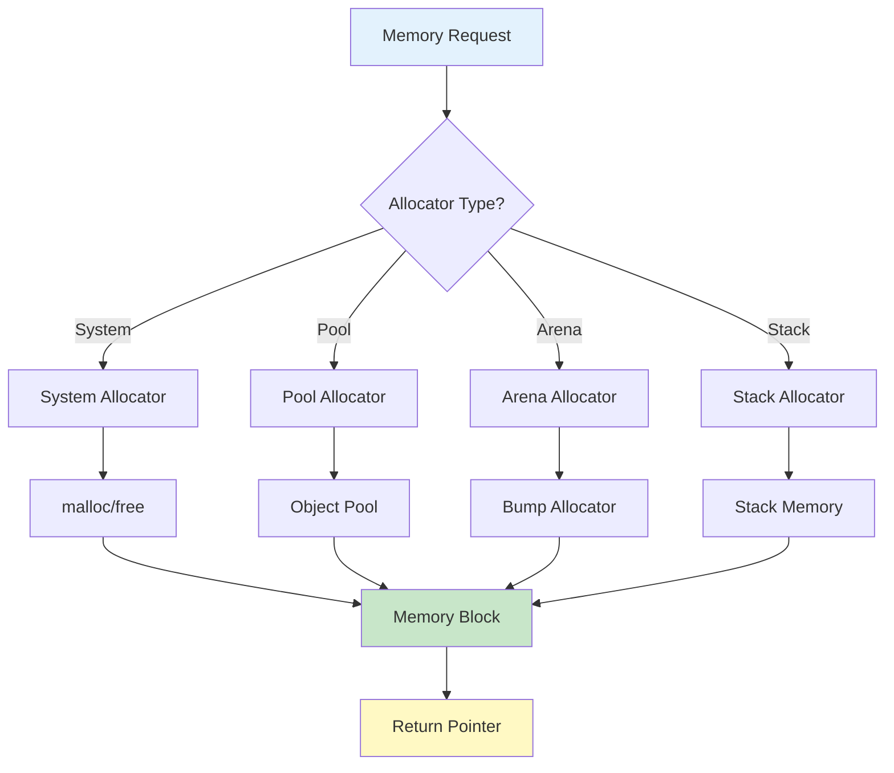

**Features:**
- Custom allocator interface
- Smart pointers (unique, shared, weak)
- RAII resource management
- Memory pool optimization
- Stack allocators for performance

### Error Handling System

Centralized error handling and reporting.

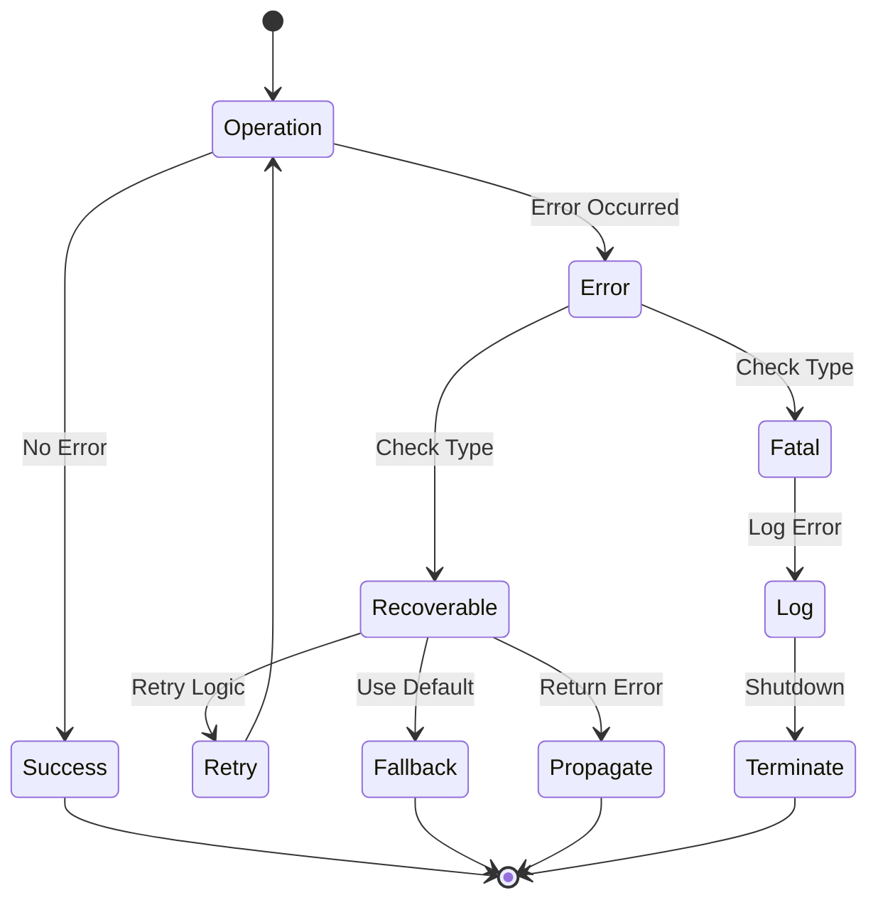

**Capabilities:**
- Result<T, E> type for recoverable errors
- Error propagation with context
- Error code to exception mapping
- Stack trace capture
- Error aggregation

### Logging System

Structured logging with multiple outputs.

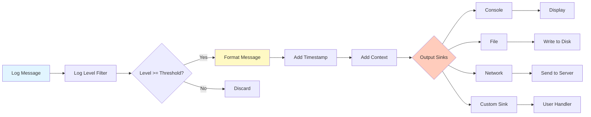

## Mid-Level Components

### Utilities Module

Collection of commonly used utility functions.

**String Utilities:**
- Trimming, splitting, joining
- Case conversion
- Pattern matching
- Unicode support

**Math Utilities:**
- Common math functions
- Statistical operations
- Random number generation
- Linear algebra basics

**I/O Utilities:**
- File operations
- Path manipulation
- Stream wrappers
- Serialization helpers

### Async Runtime

Enables asynchronous programming with coroutines.

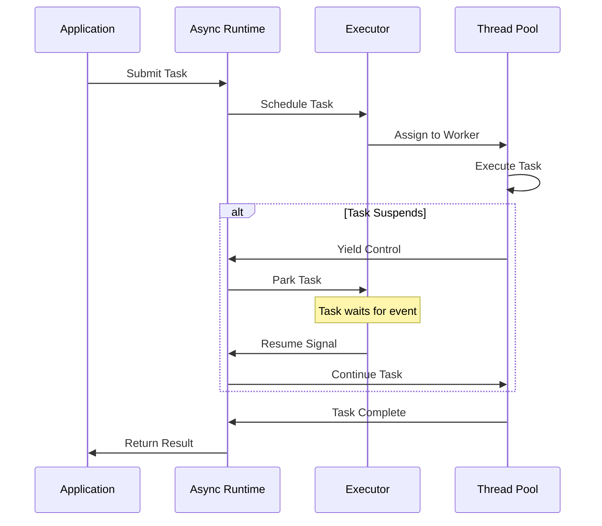

**Features:**
- Coroutine support (C++20)
- Task scheduler
- Async I/O operations
- Future/Promise pattern
- Cancellation tokens

## High-Level Components

### Network Module

High-level networking abstractions.

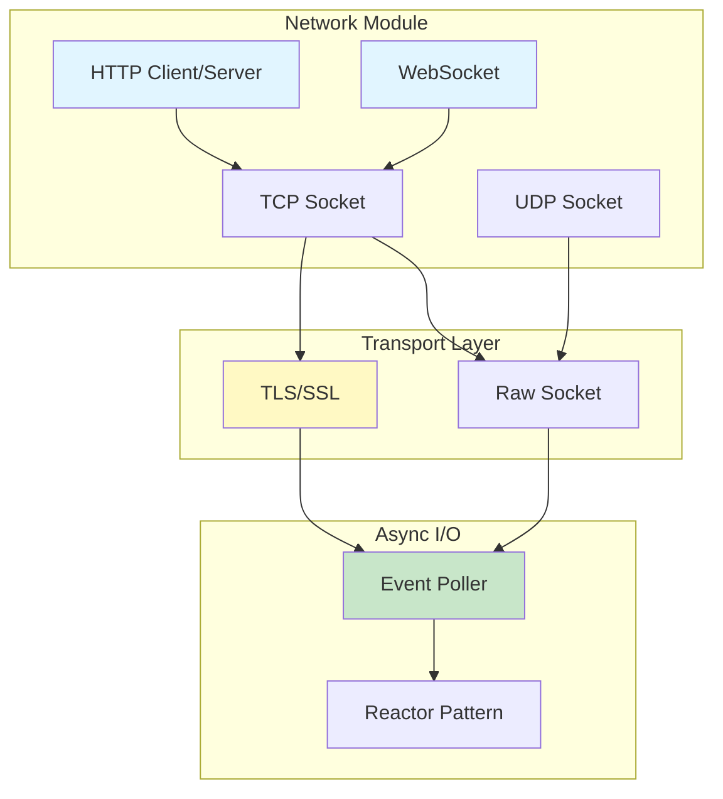

### Algorithms Module

Optimized algorithms for common operations.

**Categories:**
- Sorting algorithms (sequential and parallel)
- Search algorithms
- Transform algorithms
- Numerical algorithms
- Graph algorithms

### Containers Module

STL-compatible container implementations.

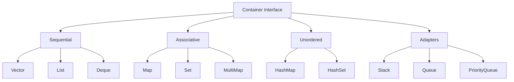

## Component Interactions

### Typical Request Flow

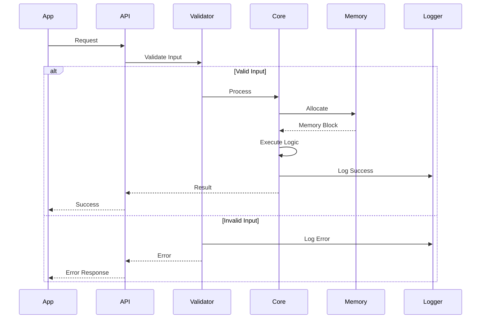

### Cross-Component Communication

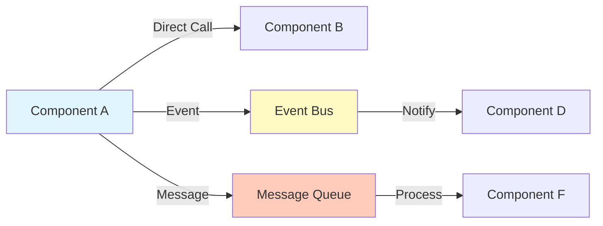

## Component Lifecycle

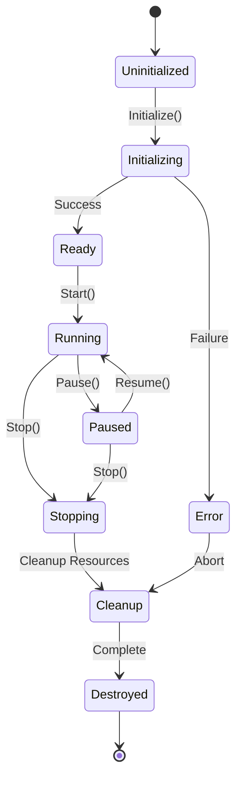

**Lifecycle Phases:**

1. **Initialization**: Load configuration, allocate resources
2. **Ready**: Component ready for use
3. **Running**: Active processing
4. **Paused**: Temporarily suspended
5. **Stopping**: Graceful shutdown initiated
6. **Cleanup**: Release resources
7. **Destroyed**: Component terminated

## Extension Points

### Plugin Architecture

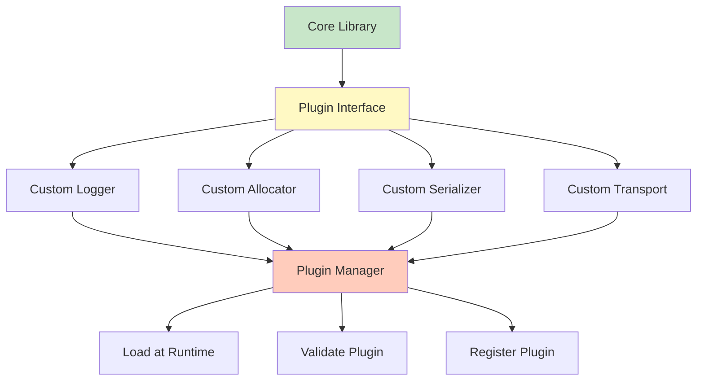

**Extension Mechanisms:**
- Template specialization
- Virtual interfaces
- Callback registration
- Policy-based design
- Plugin system

## Performance Considerations

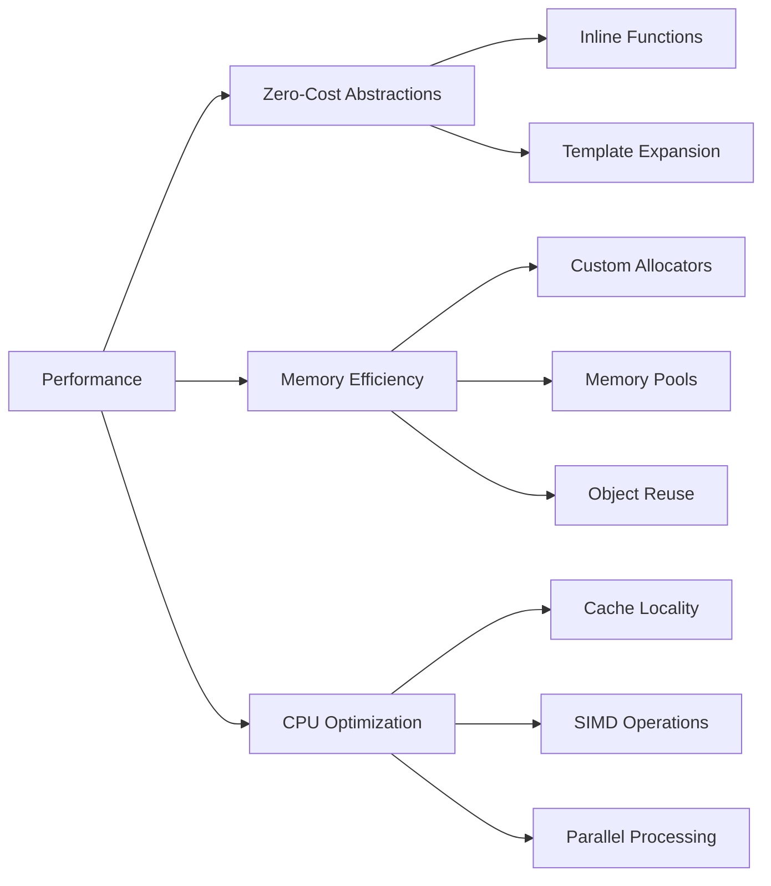

## See Also

- [Design Principles](design-principles.md) - Architectural philosophy
- [Data Flow](data-flow.md) - Data movement patterns
- [Threading Model](threading.md) - Concurrency architecture
- [API Reference](../api-reference/index.md) - Detailed API docs
