# Data Flow

Understanding how data flows through the system.

## Overview

This document describes how data moves through the various components of the library, including synchronous and asynchronous patterns.

## General Data Flow Architecture

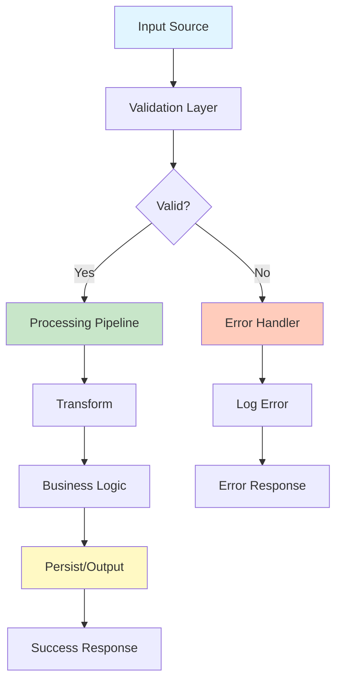

## Data Flow Patterns

### 1. Request-Response Pattern

The most common synchronous data flow pattern.

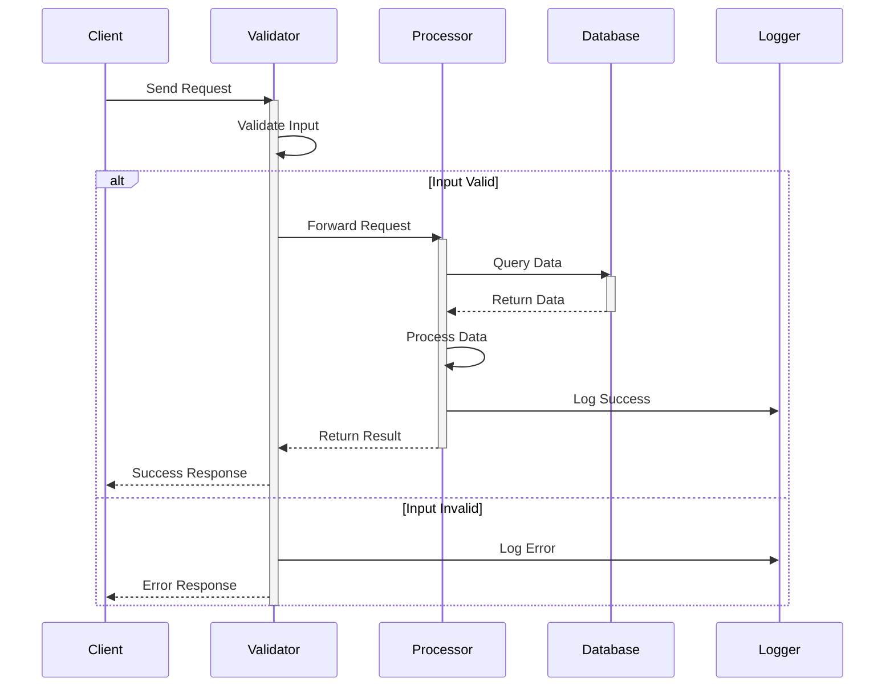

### 2. Pipeline Pattern

Data flows through a series of transformation stages.

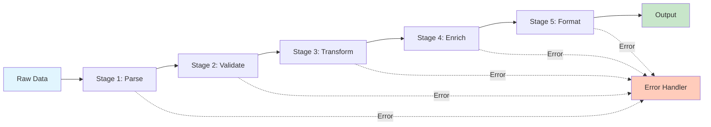

**Example:**
```cpp
auto result = load_data("input.json")
    | parse_json()
    | validate_schema()
    | transform_fields()
    | enrich_with_defaults()
    | format_output();
```

### 3. Pub-Sub Pattern

Event-driven data flow with publishers and subscribers.

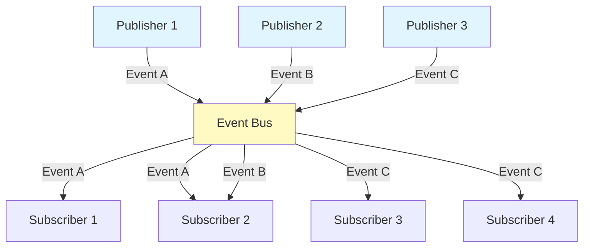

### 4. Stream Processing

Continuous data flow for real-time processing.

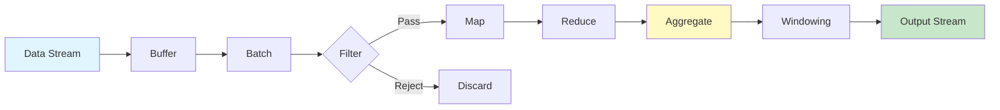

## Asynchronous Data Flow

### Async Request Flow

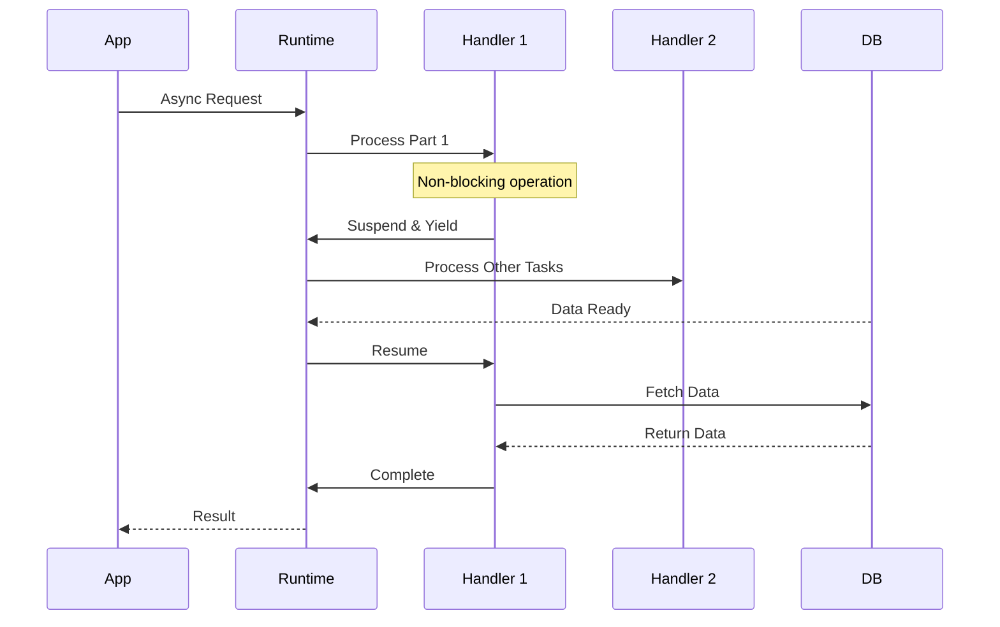

### Parallel Data Flow

Multiple data streams processed concurrently.

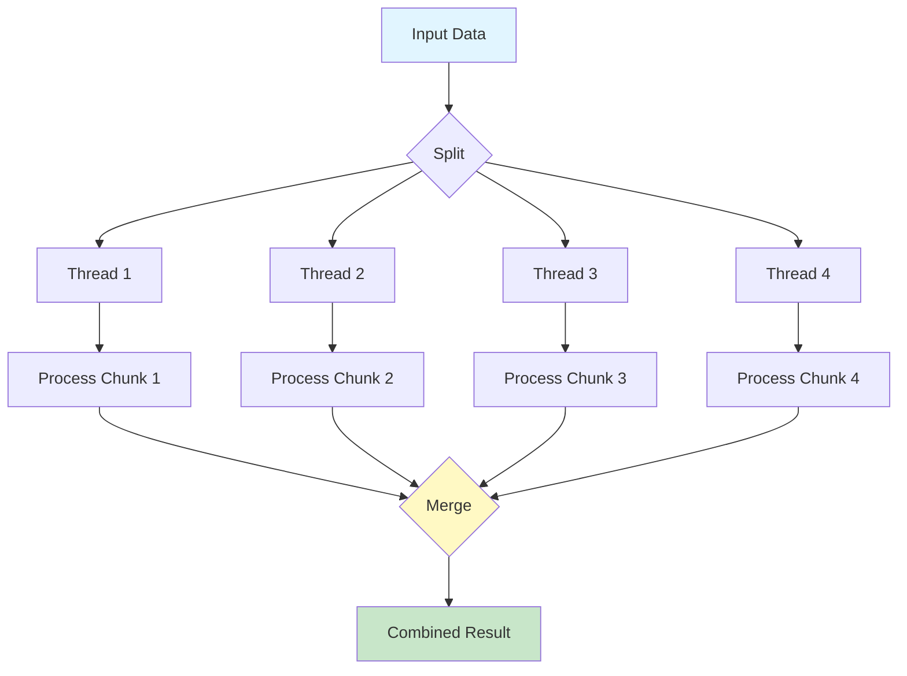

## State Management

### State Transitions

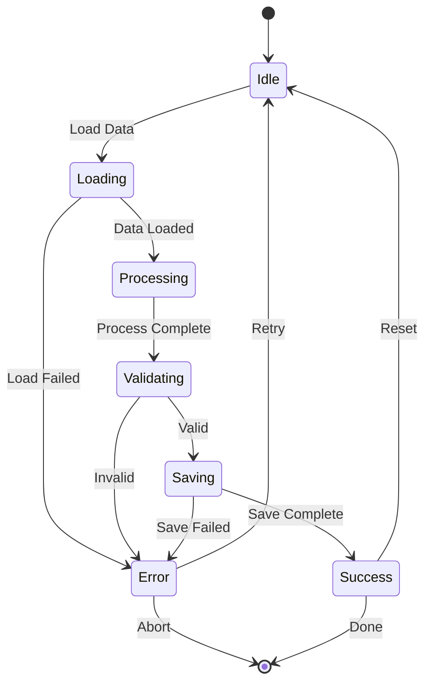

### State Storage Flow

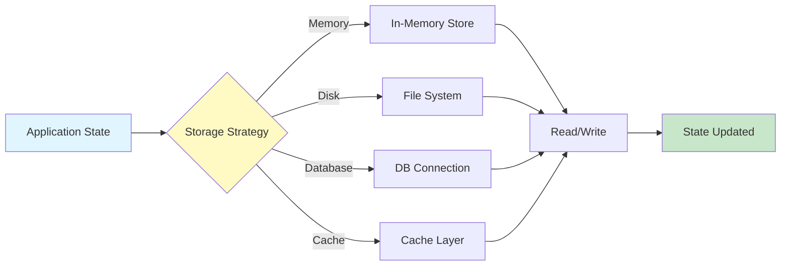

## Event Handling

### Event Lifecycle

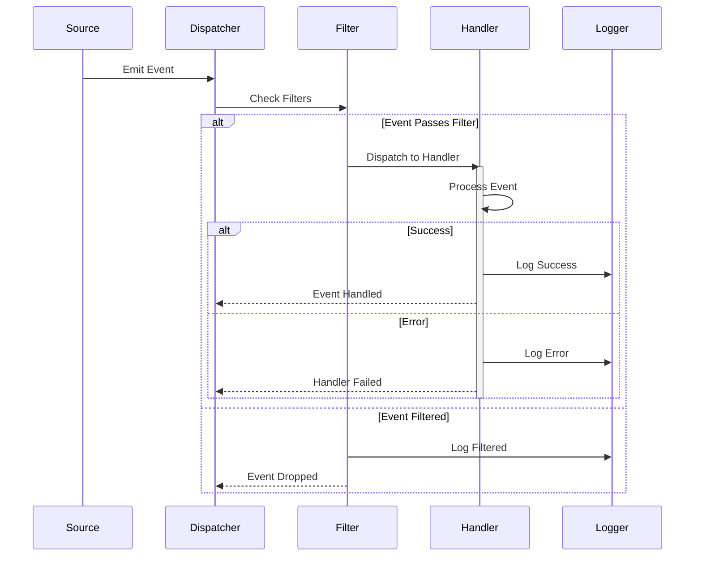

### Event Bus Architecture

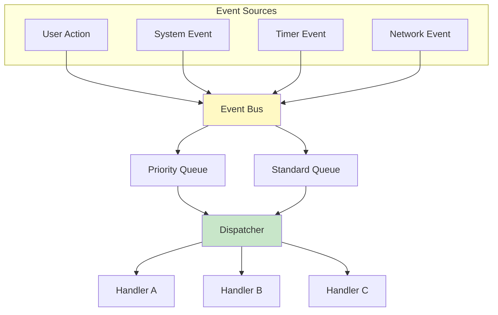

## Data Transformation Patterns

### Map-Reduce Flow

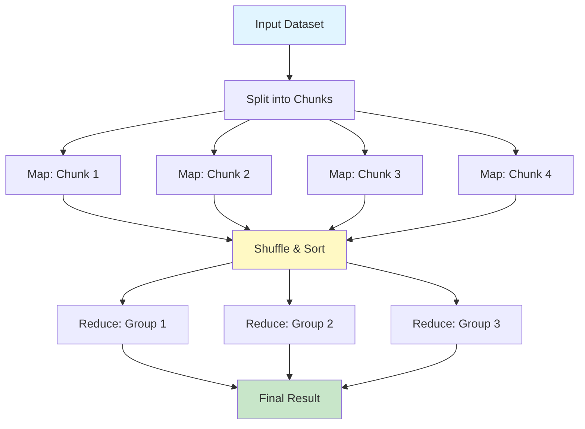

### Filter-Map-Reduce Chain

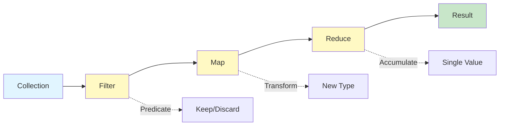

## Memory Flow

### Object Lifetime

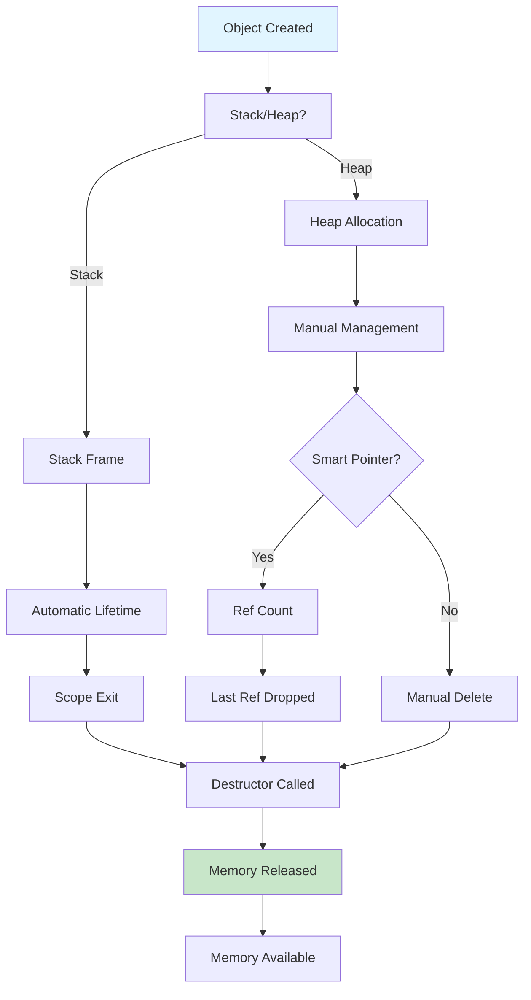

### Memory Pool Flow

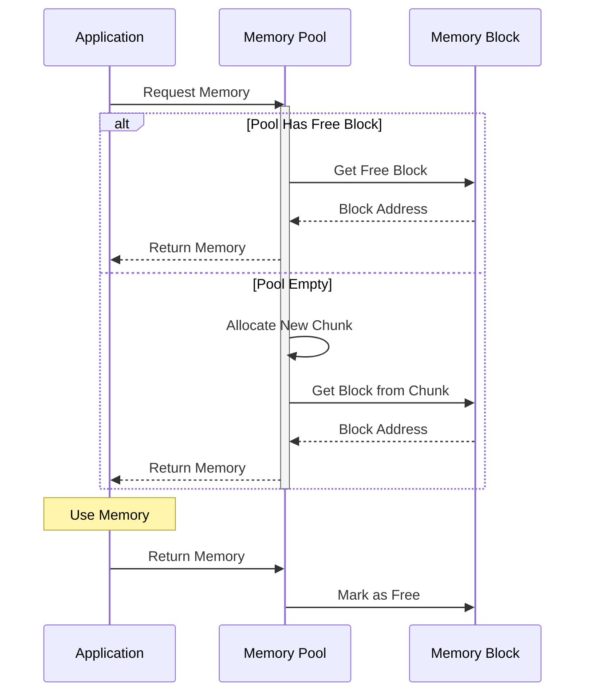

## Caching Flow

### Multi-Level Cache

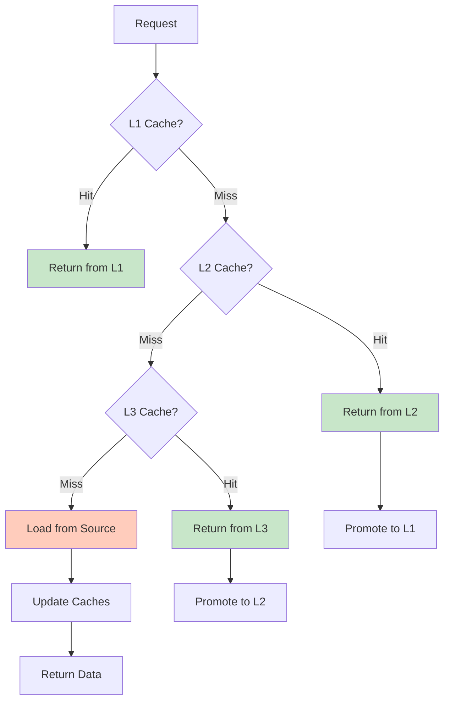

## Best Practices

### 1. Minimize Data Copies

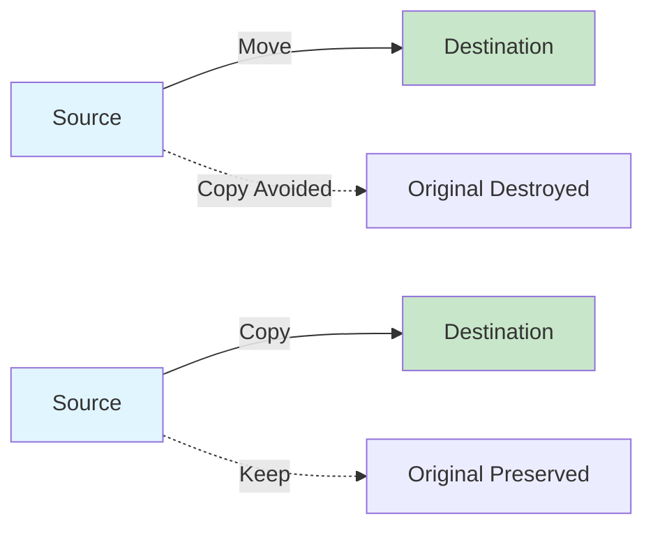

**Prefer Move Semantics:**
```cpp
// Good: Move
Vector<int> data = create_large_vector();

// Avoid: Copy
Vector<int> data = Vector<int>(create_large_vector());
```

### 2. Pipeline Optimization

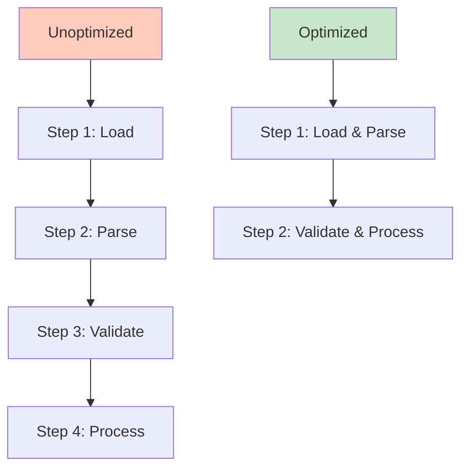

### 3. Lazy Evaluation

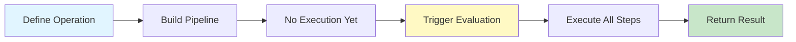

## See Also

- [Components](components.md) - Component interactions
- [Threading Model](threading.md) - Concurrent data flow
- [Error Handling](error-handling.md) - Error propagation
- [Performance Tips](../tutorials/advanced-performance.md) - Optimization techniques
