# Error Handling

Error handling strategies and patterns used throughout the library.

## Overview

This document describes the error handling philosophy and mechanisms in the library.

## Error Handling Architecture

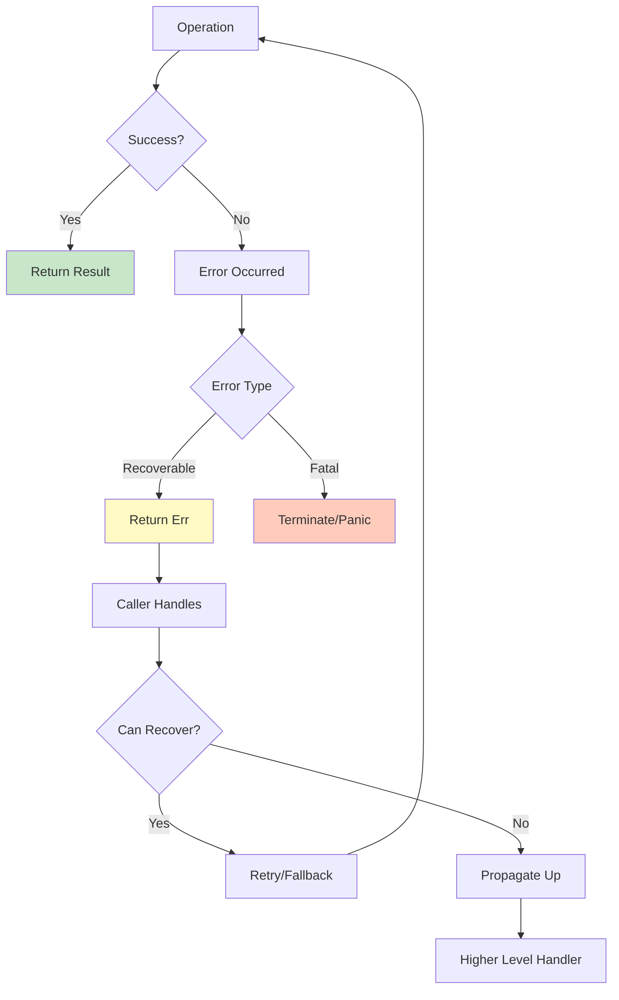

## Error Categories

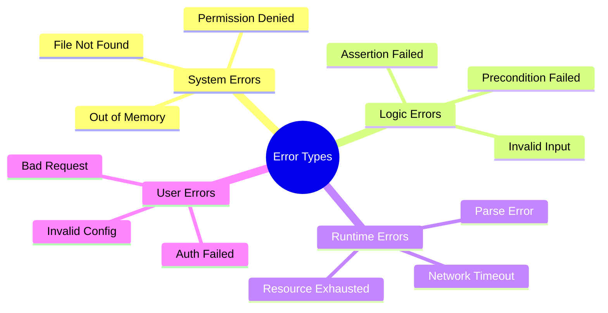

## Error Handling Strategy

### Result Type Pattern

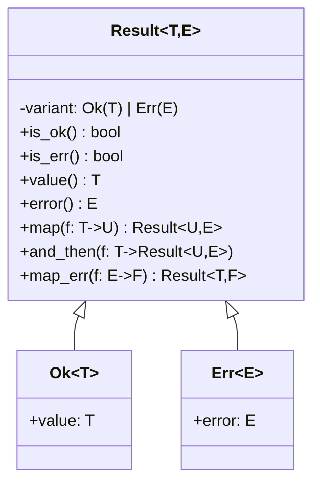

### Error Propagation Flow

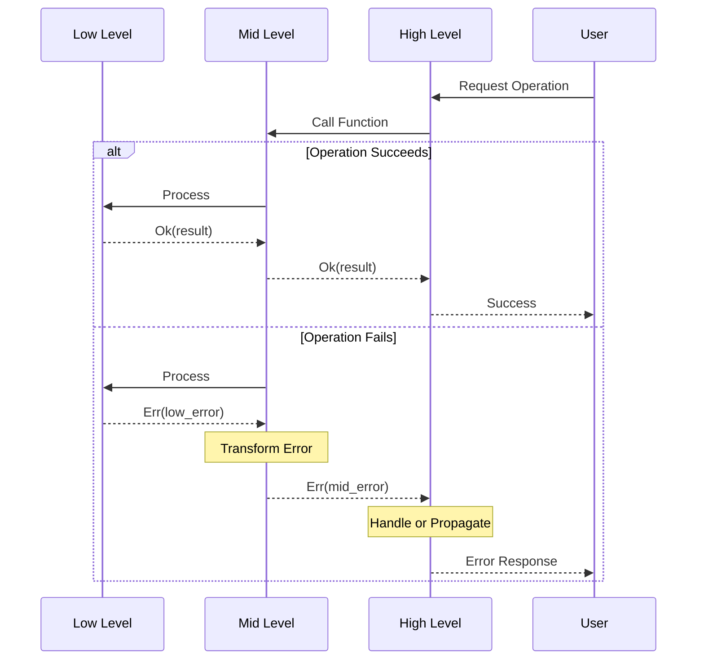

## Exception Types Hierarchy

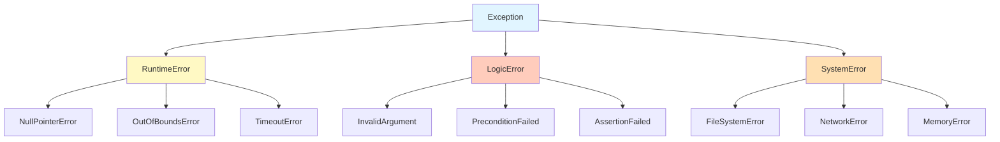

## Error Context Chain

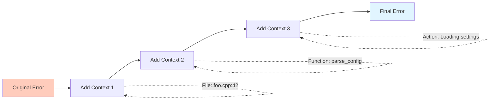

## Error Recovery Strategies

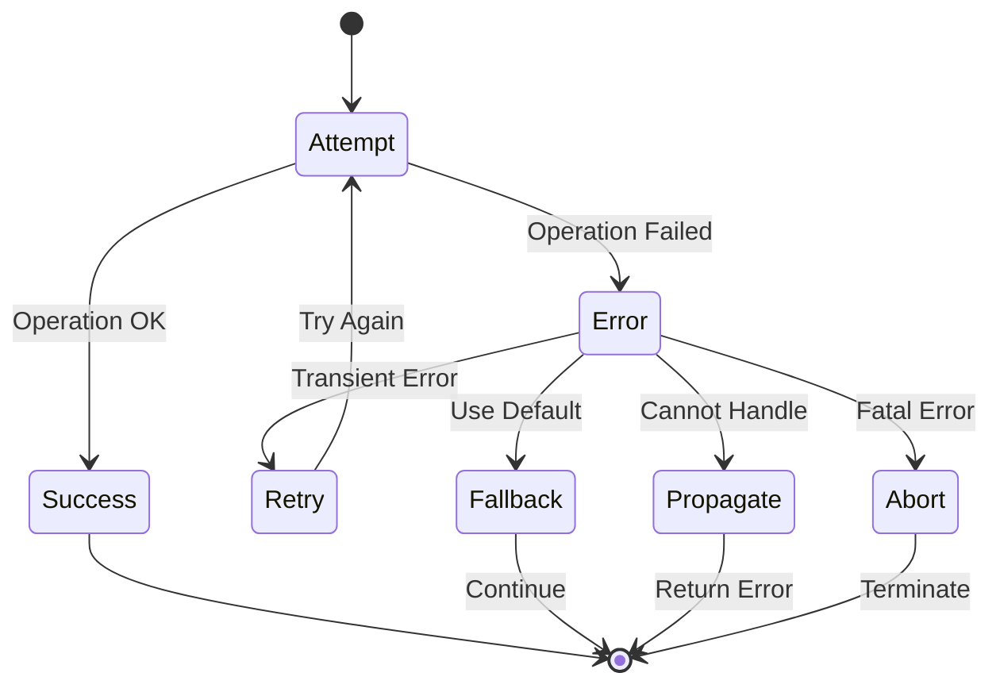

## Error Logging Flow

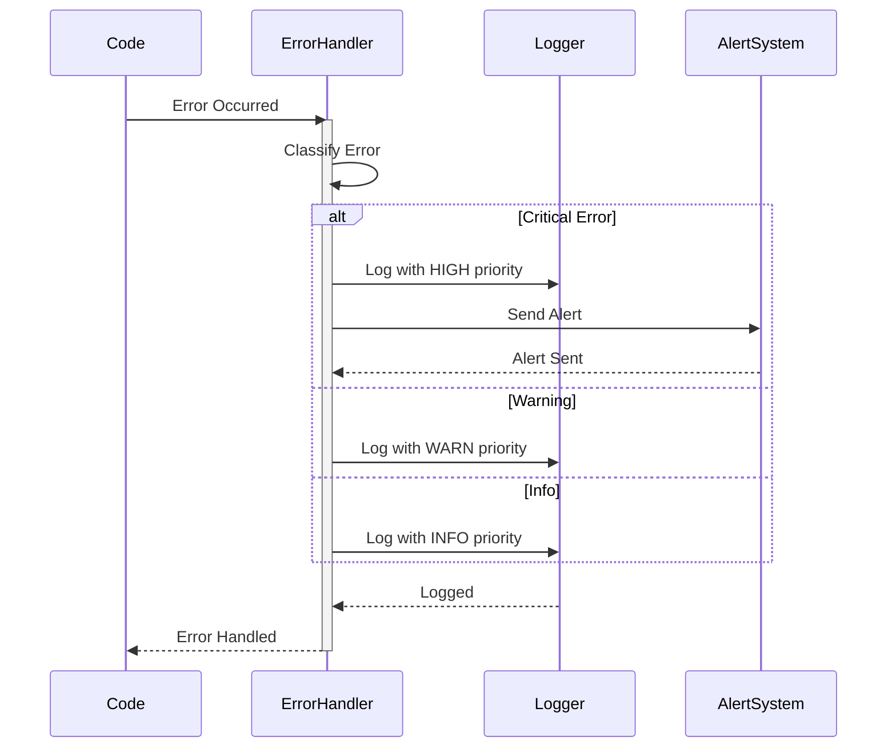

## Best Practices

### Error Handling Decision Tree

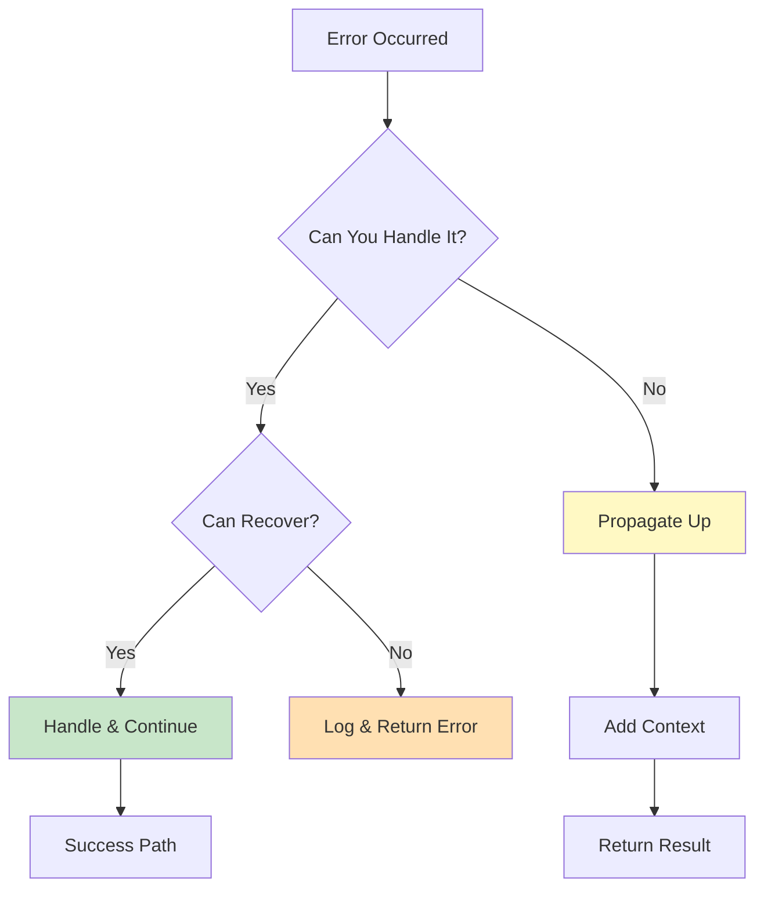

### When to Use Each Approach

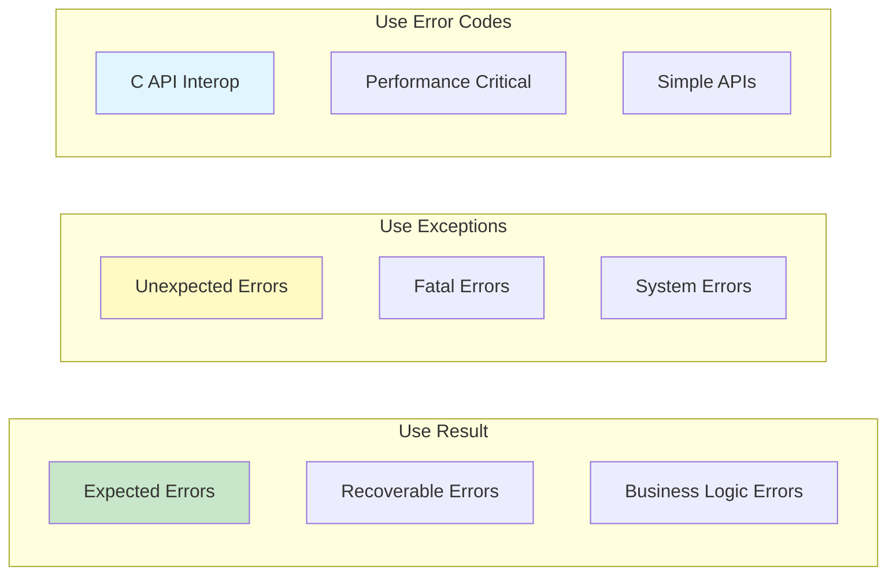

## Error Message Guidelines

### Error Message Structure

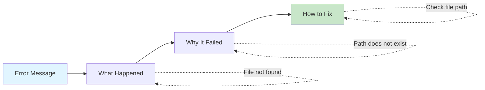

## Error Types Comparison

| Feature | Result<T,E> | Exceptions | Error Codes |
|---------|------------|------------|-------------|
| **Performance** | ⭐⭐⭐⭐⭐ | ⭐⭐ | ⭐⭐⭐⭐⭐ |
| **Type Safety** | ⭐⭐⭐⭐⭐ | ⭐⭐⭐⭐ | ⭐⭐ |
| **Composability** | ⭐⭐⭐⭐⭐ | ⭐⭐⭐ | ⭐⭐ |
| **Error Context** | ⭐⭐⭐⭐⭐ | ⭐⭐⭐⭐⭐ | ⭐⭐ |
| **C Interop** | ⭐⭐ | ⭐ | ⭐⭐⭐⭐⭐ |

## Example Patterns

### Layered Error Handling

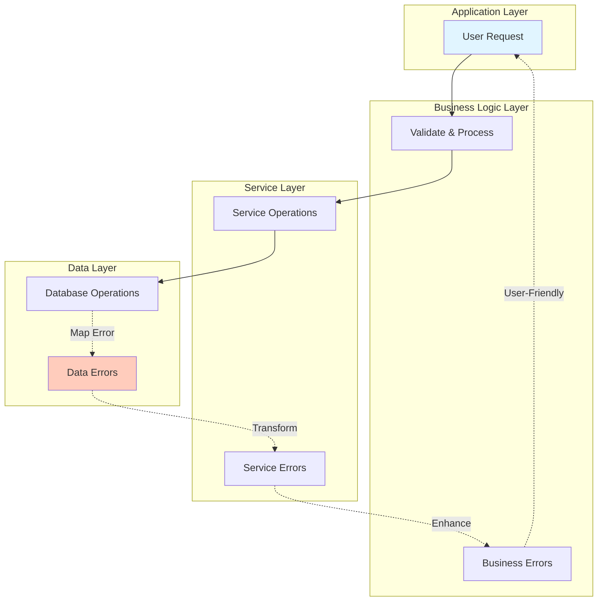

## See Also

- [Architecture Overview](index.md) - System design
- [Components](components.md) - Component interactions
- [Data Flow](data-flow.md) - Error flow patterns
- [Development: Debugging](../development/debugging.md) - Debugging techniques
