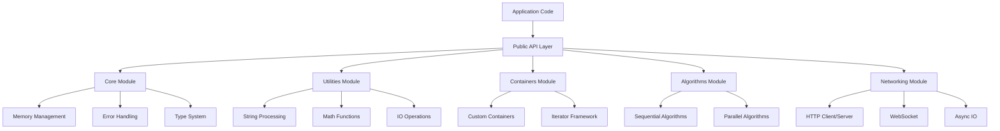
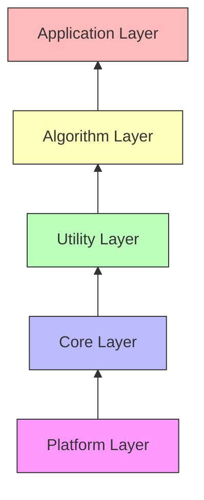
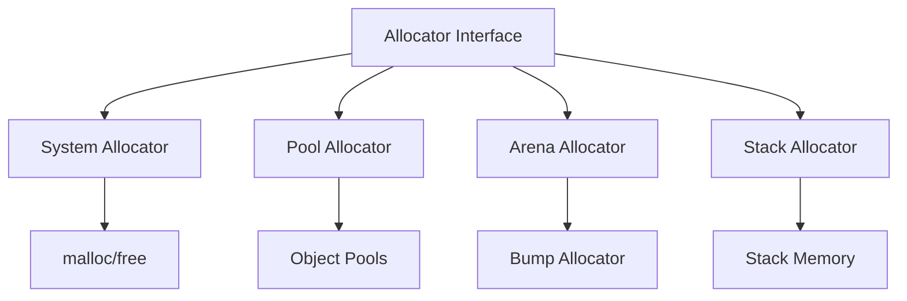
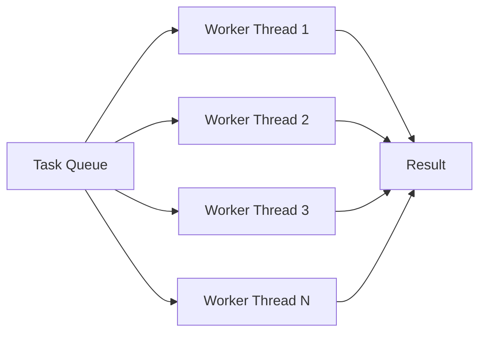
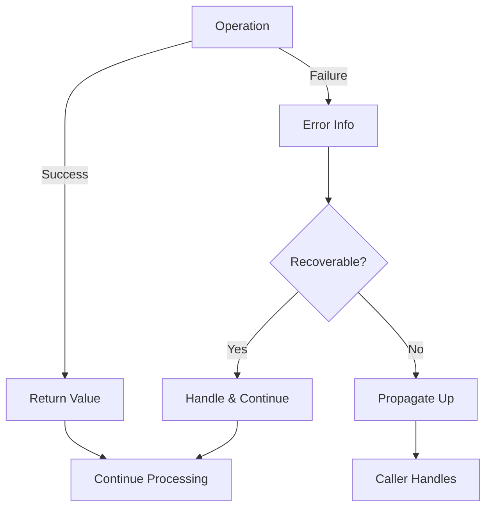
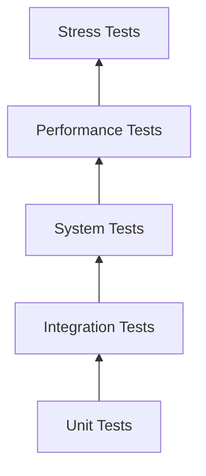

# Architecture Overview

Verstehe die Architektur und Design-Entscheidungen der C++ Advanced Library.

## High-Level Architecture



## Design Principles

### 1. Zero-Cost Abstractions

AdvLib nutzt C++ Templates und Inline-Functions für Abstractions ohne Runtime-Overhead:

```cpp
// Template-based abstraction
template<typename T>
class Vector {
    T* data_;
    size_t size_;

public:
    // Inlined for zero overhead
    T& operator[](size_t i) {
        return data_[i];  // Direct access, same as raw array
    }
};

// Equivalent to:
T* arr = new T[10];
arr[5] = value;  // Same assembly code
```

### 2. Type Safety

Starkes Typ-System verhindert Fehler zur Compile-Zeit:

```cpp
// Weak typing (error-prone)
void process(int user_id, int product_id);
process(product_id, user_id);  // Oops! Wrong order

// Strong typing (compile-time error)
void process(UserId user, ProductId product);
process(product, user);  // Compile error!
```

### 3. Modern C++ Practices

- **RAII** für automatisches Resource Management
- **Move Semantics** für effizienten Transfer
- **Concepts** für bessere Template-Fehler
- **Ranges** für komposierbare Operationen

```cpp
// RAII
{
    File f("data.txt");  // Opened
    f.write("data");
}  // Automatically closed

// Move semantics
Vector<int> create_large_vector() {
    Vector<int> v(1000000);
    return v;  // Moved, not copied
}

// Concepts
template<Sortable T>
void sort(T& container);  // Clear requirements
```

### 4. Performance by Default

Optimierte Defaults, explizite Konfiguration für Spezialfälle:

```cpp
// Default: Optimized for performance
Vector<int> v;
v.push_back(42);  // Fast path

// Explicit: Thread-safe when needed
ConcurrentVector<int> cv;
cv.push_back(42);  // Synchronized
```

### 5. Composability

Komponenten sind designed um zusammenzuarbeiten:

```cpp
// Compose utilities
auto result = load_file("config.json")
    .and_then(parse_json)
    .map(validate_config)
    .map_err(log_error);

// Compose algorithms
data | filter(predicate)
     | transform(mapper)
     | sort()
     | take(10);
```

## Module Structure

### Core Module

**Verantwortlichkeiten:**
- Fundamentale Types (String, Result, Optional)
- Memory Management (Smart Pointers, Allocators)
- Error Handling
- Logging System

**Design:**
- Minimal Dependencies
- Header-Only wo möglich
- Platform-agnostic

### Utilities Module

**Verantwortlichkeiten:**
- String Processing
- Math Functions
- IO Operations
- Time/Date Handling

**Design:**
- Stateless Functions
- Pure Functions wo möglich
- Extensive Unit Tests

### Containers Module

**Verantwortlichkeiten:**
- Custom Container Implementations
- Iterator Framework
- Allocator Support

**Design:**
- STL-Compatible Interfaces
- Optimized Implementations
- Exception-Safe

### Algorithms Module

**Verantwortlichkeiten:**
- Sequential Algorithms
- Parallel Algorithms
- SIMD Operations

**Design:**
- Generic Programming
- Concept-Based Constraints
- Configurable Execution Policy

### Networking Module

**Verantwortlichkeiten:**
- HTTP Client/Server
- WebSocket
- Async IO

**Design:**
- Async/Await Pattern
- Non-blocking IO
- Thread Pool Integration

## Layer Architecture



### Platform Layer

Low-level platform-specific code:

```cpp
namespace advlib::platform {
    // OS-specific implementations
    namespace windows { /* ... */ }
    namespace linux { /* ... */ }
    namespace macos { /* ... */ }

    // Unified interface
    void* allocate_memory(size_t bytes);
    void free_memory(void* ptr);
}
```

### Core Layer

Platform-independent fundamentals:

```cpp
namespace advlib {
    class String { /* ... */ };
    template<typename T, typename E>
    class Result { /* ... */ };
}
```

### Utility Layer

Higher-level utilities built on Core:

```cpp
namespace advlib {
    String to_upper(const String& str);  // Uses Core String
    Result<Json, Error> parse_json(const String& str);
}
```

## Memory Management Strategy

### Allocator Framework



### Allocation Strategies

```cpp
// System allocator (default)
Vector<int> v1;  // Uses malloc/free

// Pool allocator (fast for same-sized objects)
Vector<int, PoolAllocator<int>> v2;

// Arena allocator (fast bulk allocation)
Arena arena(1024 * 1024);  // 1MB
Vector<int> v3(ArenaAllocator<int>(&arena));

// Stack allocator (no heap allocation)
SmallVector<int, 16> v4;  // Up to 16 elements on stack
```

## Concurrency Architecture

### Thread Pool Design



### Lock-Free Design

```cpp
// Lock-free queue for inter-thread communication
template<typename T>
class LockFreeQueue {
    std::atomic<Node*> head_;
    std::atomic<Node*> tail_;

    // Wait-free operations
    bool try_push(const T& value);
    bool try_pop(T& value);
};
```

## Error Handling Strategy

### Error Propagation



### Layered Error Handling

```cpp
// Low-level: System errors
Result<File, SystemError> open_file(const String& path);

// Mid-level: Domain errors
Result<Config, ConfigError> load_config(const String& path);

// High-level: Application errors
Result<App, AppError> initialize_app(const Config& config);

// Error conversion
auto result = open_file("config.json")
    .map_err([](SystemError e) {
        return ConfigError::from_system_error(e);
    });
```

## Build System Architecture

### Module Independence

```cmake
# Each module is independent
add_library(advlib_core ...)
add_library(advlib_utilities ...)
add_library(advlib_containers ...)

# With explicit dependencies
target_link_libraries(advlib_utilities
    PUBLIC advlib_core
)
```

### Header Organization

```
advlib/
├── core/
│   ├── string.hpp        # Public header
│   ├── result.hpp
│   └── detail/           # Implementation details
│       ├── string_impl.hpp
│       └── result_impl.hpp
├── utilities/
│   ├── string.hpp
│   └── math.hpp
└── containers/
    ├── vector.hpp
    └── hash_map.hpp
```

## Testing Architecture

### Multi-Level Testing



### Test Organization

```cpp
// Unit tests: Test single components
TEST(StringTest, BasicOperations) {
    String s("hello");
    EXPECT_EQ(s.length(), 5);
}

// Integration tests: Test component interaction
TEST(ConfigTest, LoadAndParse) {
    auto result = load_config("test.json")
        .and_then(validate_config);
    EXPECT_TRUE(result.is_ok());
}

// Performance tests: Benchmark critical paths
BENCHMARK(StringConcatenation) {
    String s;
    for (int i = 0; i < 1000; ++i) {
        s = s + "x";
    }
}
```

## Weitere Informationen

- [Design Principles](design-principles.md) - Detaillierte Design-Entscheidungen
- [Component Overview](components.md) - Einzelne Komponenten
- [Threading Model](threading.md) - Concurrency-Architektur
- [Error Handling](error-handling.md) - Error-Handling-Strategie

## Contributing

Möchtest du zur Architektur beitragen?

- Lese [Contributing Guide](../development/contributing.md)
- Diskutiere in [Architecture Discussions](https://github.com/youruser/advlib/discussions/categories/architecture)
