# Threading and Concurrency

Architecture and design of threading and concurrency support.

## Overview

This document describes the threading model and concurrency architecture of the library.

## Threading Architecture

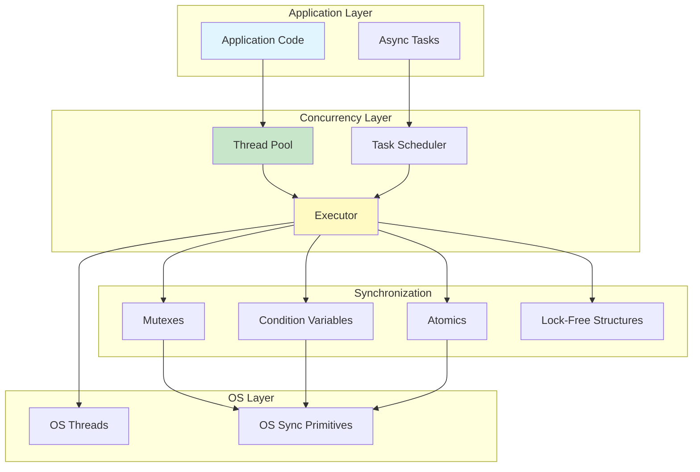
```mermaid
graph TB
    subgraph "Application Layer"
        APP[Application Code]
        ASYNC[Async Tasks]
    end

    subgraph "Concurrency Layer"
        TP[Thread Pool]
        SCHED[Task Scheduler]
        EXEC[Executor]
    end

    subgraph "Synchronization"
        MUTEX[Mutexes]
        COND[Condition Variables]
        ATOMIC[Atomics]
        LOCK[Lock-Free Structures]
    end

    subgraph "OS Layer"
        OS_THREAD[OS Threads]
        OS_SYNC[OS Sync Primitives]
    end

    APP --> TP
    ASYNC --> SCHED

    TP --> EXEC
    SCHED --> EXEC

    EXEC --> MUTEX
    EXEC --> COND
    EXEC --> ATOMIC
    EXEC --> LOCK

    MUTEX --> OS_SYNC
    COND --> OS_SYNC
    ATOMIC --> OS_SYNC

    EXEC --> OS_THREAD

    style APP fill:#e1f5ff
    style TP fill:#c8e6c9
    style EXEC fill:#fff9c4
```

## Threading Model

### Thread Pool Architecture

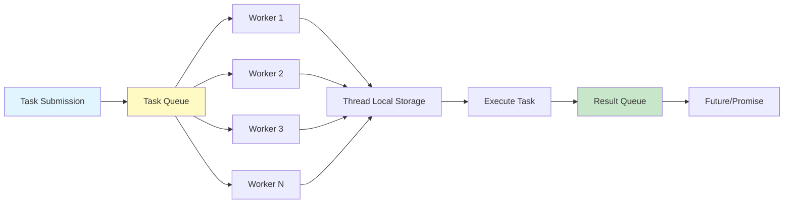
```mermaid
graph LR
    A[Task Submission] --> B[Task Queue]

    B --> W1[Worker 1]
    B --> W2[Worker 2]
    B --> W3[Worker 3]
    B --> W4[Worker N]

    W1 --> C[Thread Local Storage]
    W2 --> C
    W3 --> C
    W4 --> C

    C --> D[Execute Task]
    D --> E[Result Queue]

    E --> F[Future/Promise]

    style A fill:#e1f5ff
    style B fill:#fff9c4
    style E fill:#c8e6c9
```

### Work-Stealing Model

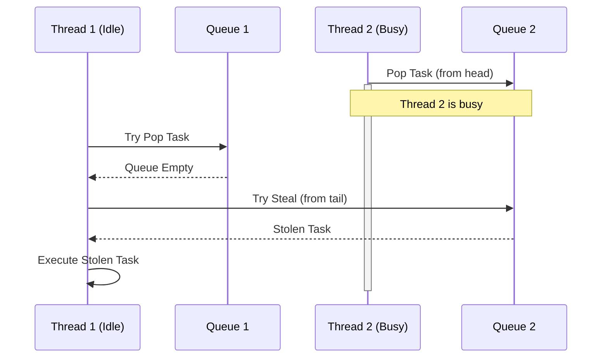
```mermaid
sequenceDiagram
    participant T1 as Thread 1 (Idle)
    participant Q1 as Queue 1
    participant T2 as Thread 2 (Busy)
    participant Q2 as Queue 2

    T2->>Q2: Pop Task (from head)
    activate T2
    Note over T2,Q2: Thread 2 is busy

    T1->>Q1: Try Pop Task
    Q1-->>T1: Queue Empty

    T1->>Q2: Try Steal (from tail)
    Q2-->>T1: Stolen Task

    T1->>T1: Execute Stolen Task
    deactivate T2
```

## Thread Safety Levels

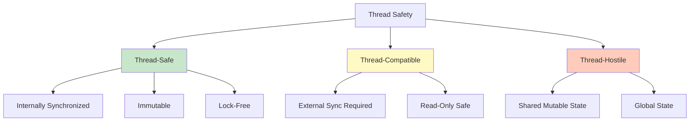
```mermaid
graph TD
    A[Thread Safety] --> B[Thread-Safe]
    A --> C[Thread-Compatible]
    A --> D[Thread-Hostile]

    B --> B1[Internally Synchronized]
    B --> B2[Immutable]
    B --> B3[Lock-Free]

    C --> C1[External Sync Required]
    C --> C2[Read-Only Safe]

    D --> D1[Shared Mutable State]
    D --> D2[Global State]

    style B fill:#c8e6c9
    style C fill:#fff9c4
    style D fill:#ffccbc
```

## Synchronization Primitives

### Mutex Hierarchy

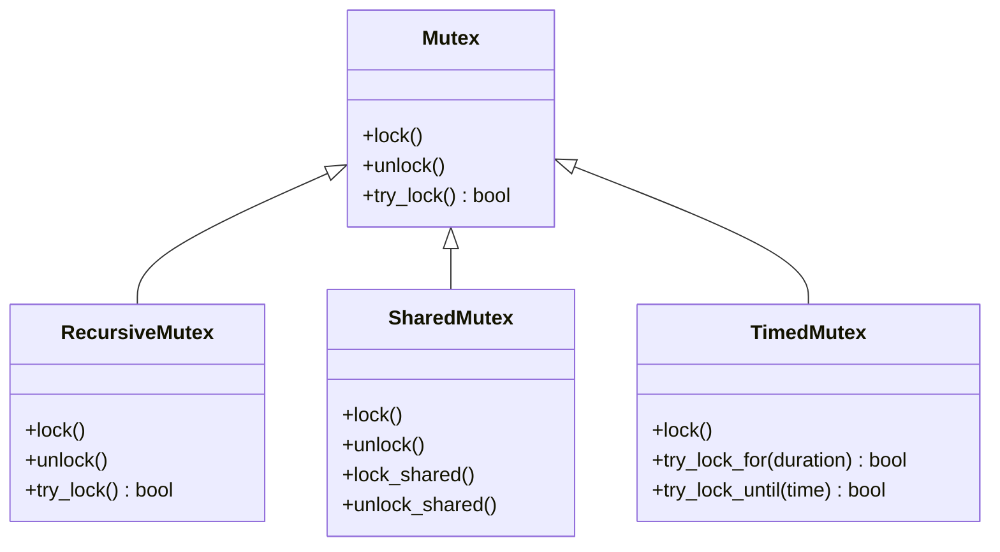
```mermaid
classDiagram
    class Mutex {
        +lock()
        +unlock()
        +try_lock() bool
    }

    class RecursiveMutex {
        +lock()
        +unlock()
        +try_lock() bool
    }

    class SharedMutex {
        +lock()
        +unlock()
        +lock_shared()
        +unlock_shared()
    }

    class TimedMutex {
        +lock()
        +try_lock_for(duration) bool
        +try_lock_until(time) bool
    }

    Mutex <|-- RecursiveMutex
    Mutex <|-- SharedMutex
    Mutex <|-- TimedMutex
```

### Lock Acquisition Pattern

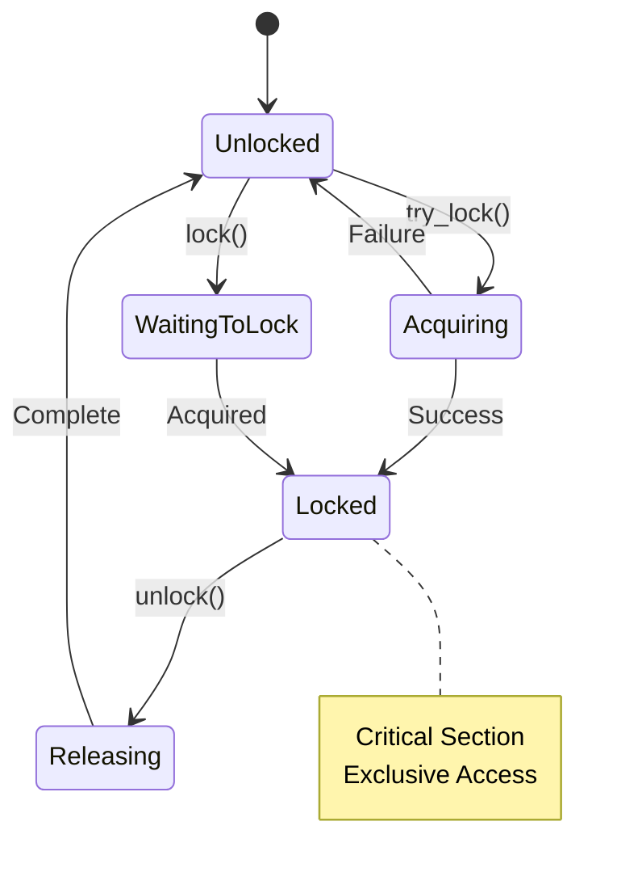
```mermaid
stateDiagram-v2
    [*] --> Unlocked

    Unlocked --> Acquiring: try_lock()
    Acquiring --> Locked: Success
    Acquiring --> Unlocked: Failure

    Locked --> Releasing: unlock()
    Releasing --> Unlocked: Complete

    Unlocked --> WaitingToLock: lock()
    WaitingToLock --> Locked: Acquired

    note right of Locked
        Critical Section
        Exclusive Access
    end note
```

### Condition Variable Flow

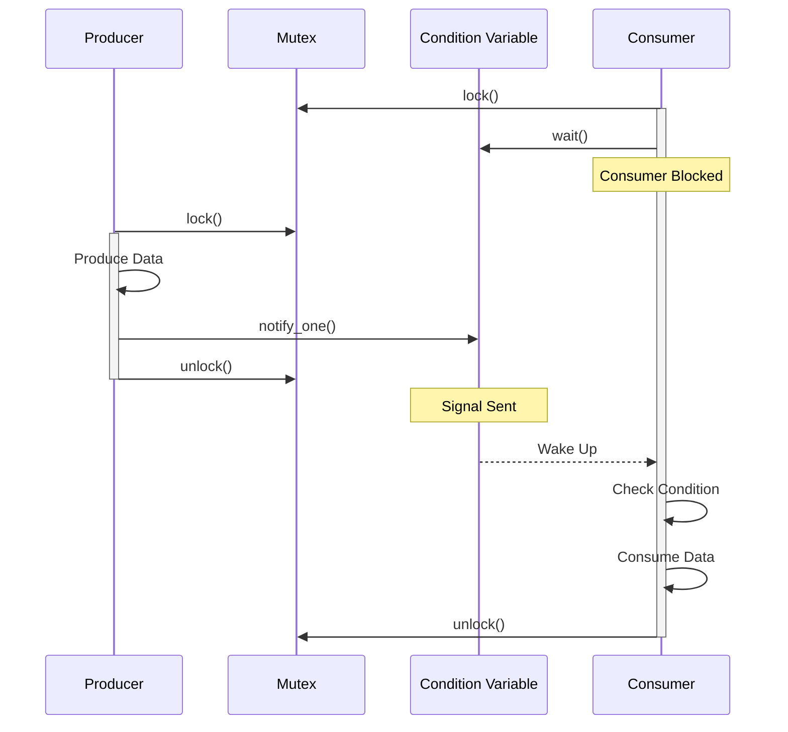
```mermaid
sequenceDiagram
    participant P as Producer
    participant M as Mutex
    participant CV as Condition Variable
    participant C as Consumer

    C->>M: lock()
    activate C
    C->>CV: wait()
    Note over C: Consumer Blocked

    P->>M: lock()
    activate P
    P->>P: Produce Data
    P->>CV: notify_one()
    P->>M: unlock()
    deactivate P

    Note over CV: Signal Sent
    CV-->>C: Wake Up
    C->>C: Check Condition
    C->>C: Consume Data
    C->>M: unlock()
    deactivate C
```

### Atomic Operations

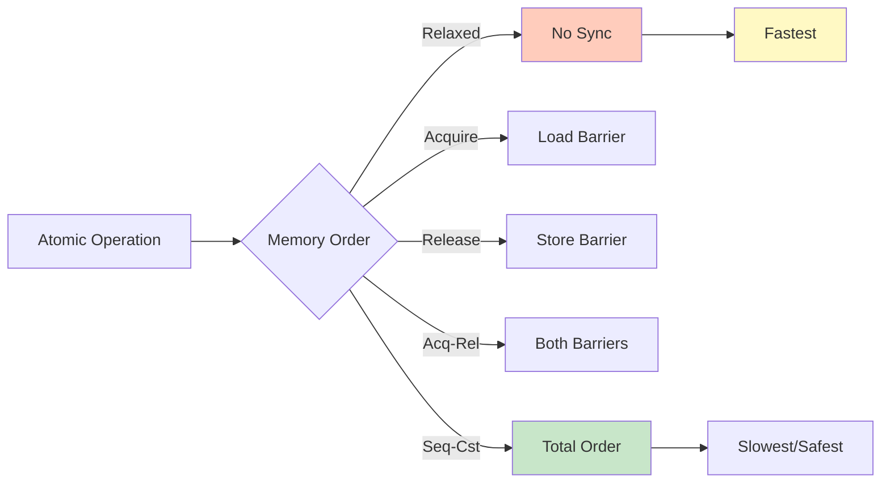
```mermaid
graph LR
    A[Atomic Operation] --> B{Memory Order}

    B -->|Relaxed| C[No Sync]
    B -->|Acquire| D[Load Barrier]
    B -->|Release| E[Store Barrier]
    B -->|Acq-Rel| F[Both Barriers]
    B -->|Seq-Cst| G[Total Order]

    C --> H[Fastest]
    G --> I[Slowest/Safest]

    style C fill:#ffccbc
    style G fill:#c8e6c9
    style H fill:#fff9c4
```

## Thread Pool Patterns

### Fixed Thread Pool

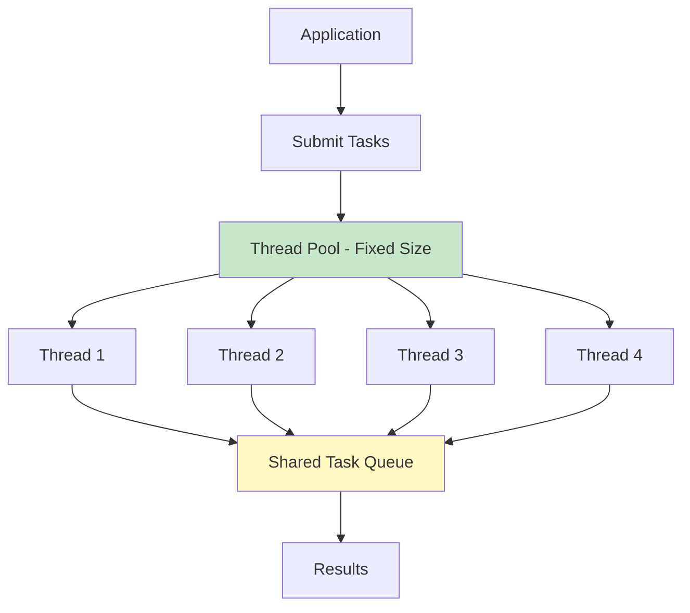
```mermaid
graph TB
    A[Application] --> B[Submit Tasks]

    B --> TP[Thread Pool - Fixed Size]

    TP --> T1[Thread 1]
    TP --> T2[Thread 2]
    TP --> T3[Thread 3]
    TP --> T4[Thread 4]

    T1 --> Q[Shared Task Queue]
    T2 --> Q
    T3 --> Q
    T4 --> Q

    Q --> R[Results]

    style TP fill:#c8e6c9
    style Q fill:#fff9c4
```

### Dynamic Thread Pool

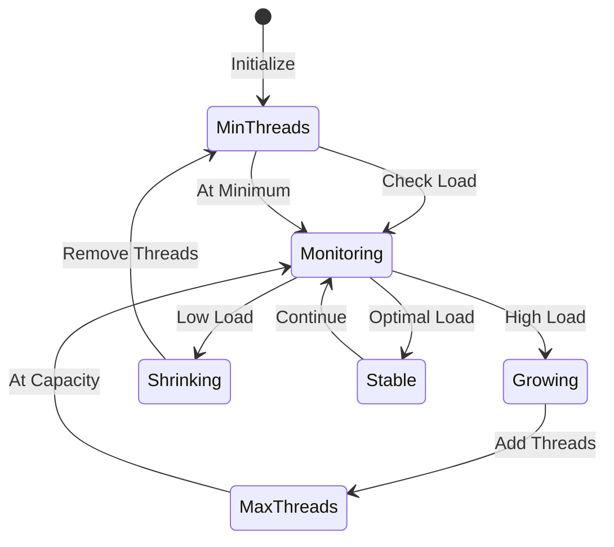
```mermaid
stateDiagram-v2
    [*] --> MinThreads: Initialize

    MinThreads --> Monitoring: Check Load

    Monitoring --> Growing: High Load
    Monitoring --> Shrinking: Low Load
    Monitoring --> Stable: Optimal Load

    Growing --> MaxThreads: Add Threads
    MaxThreads --> Monitoring: At Capacity

    Shrinking --> MinThreads: Remove Threads
    MinThreads --> Monitoring: At Minimum

    Stable --> Monitoring: Continue
```

## Async/Await Architecture

### Task Execution Flow

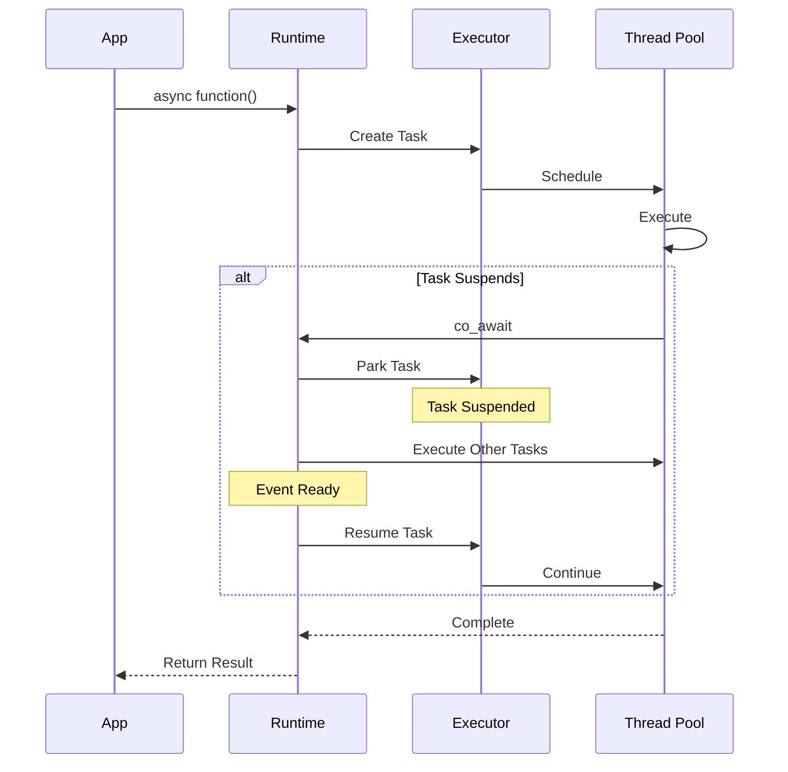
```mermaid
sequenceDiagram
    participant App
    participant RT as Runtime
    participant Ex as Executor
    participant TP as Thread Pool

    App->>RT: async function()
    RT->>Ex: Create Task

    Ex->>TP: Schedule
    TP->>TP: Execute

    alt Task Suspends
        TP->>RT: co_await
        RT->>Ex: Park Task
        Note over Ex: Task Suspended

        RT->>TP: Execute Other Tasks

        Note over RT: Event Ready
        RT->>Ex: Resume Task
        Ex->>TP: Continue
    end

    TP-->>RT: Complete
    RT-->>App: Return Result
```

### Coroutine State Machine

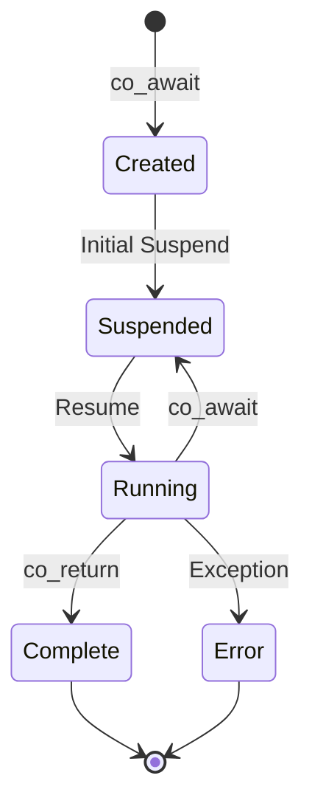
```mermaid
stateDiagram-v2
    [*] --> Created: co_await

    Created --> Suspended: Initial Suspend
    Suspended --> Running: Resume
    Running --> Suspended: co_await
    Running --> Complete: co_return
    Complete --> [*]

    Running --> Error: Exception
    Error --> [*]
```

## Lock-Free Data Structures

### Lock-Free Queue (SPSC)

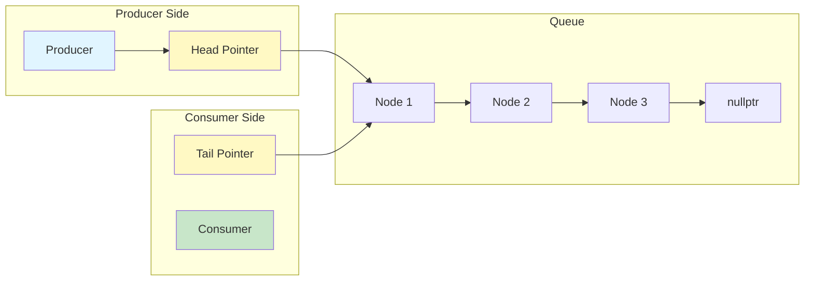
```mermaid
graph LR
    subgraph "Producer Side"
        P[Producer] --> H[Head Pointer]
    end

    subgraph "Queue"
        H --> N1[Node 1]
        N1 --> N2[Node 2]
        N2 --> N3[Node 3]
        N3 --> NULL[nullptr]
    end

    subgraph "Consumer Side"
        T[Tail Pointer] --> N1
        C[Consumer]
    end

    style P fill:#e1f5ff
    style C fill:#c8e6c9
    style H fill:#fff9c4
    style T fill:#fff9c4
```

### Compare-And-Swap (CAS) Pattern

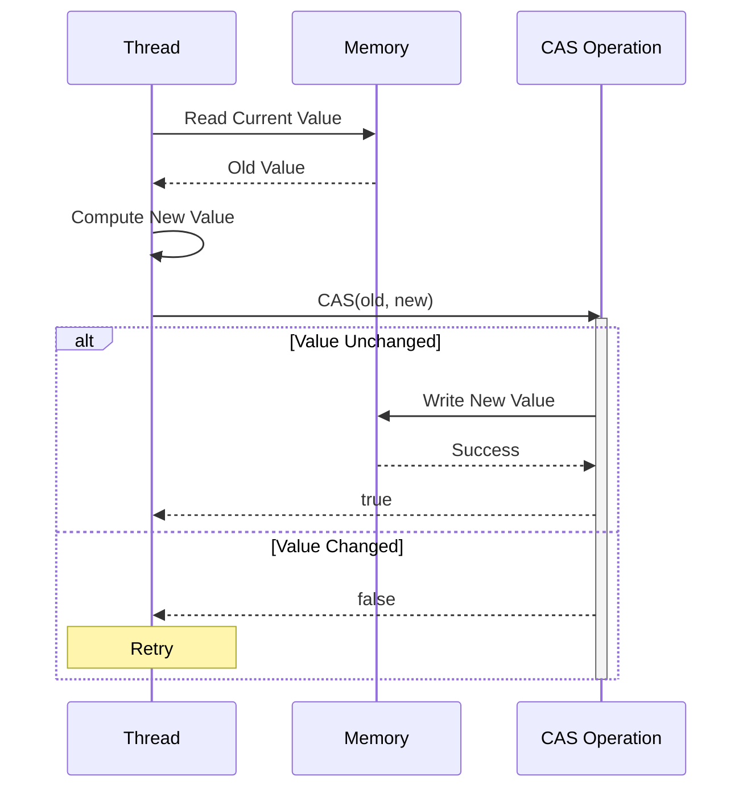
```mermaid
sequenceDiagram
    participant T as Thread
    participant M as Memory
    participant CAS as CAS Operation

    T->>M: Read Current Value
    M-->>T: Old Value

    T->>T: Compute New Value

    T->>CAS: CAS(old, new)
    activate CAS

    alt Value Unchanged
        CAS->>M: Write New Value
        M-->>CAS: Success
        CAS-->>T: true
    else Value Changed
        CAS-->>T: false
        Note over T: Retry
    end

    deactivate CAS
```

## Deadlock Prevention

### Resource Ordering

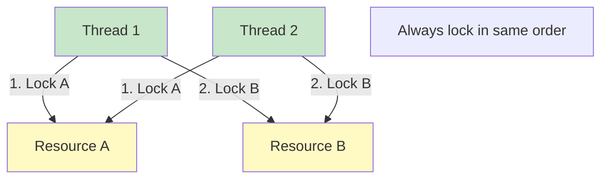
```mermaid
graph TD
    A[Thread 1] -->|1. Lock A| B[Resource A]
    A -->|2. Lock B| C[Resource B]

    D[Thread 2] -->|1. Lock A| B
    D -->|2. Lock B| C

    style A fill:#c8e6c9
    style D fill:#c8e6c9
    style B fill:#fff9c4
    style C fill:#fff9c4

    Note1[Always lock in same order]
```

### Deadlock Detection

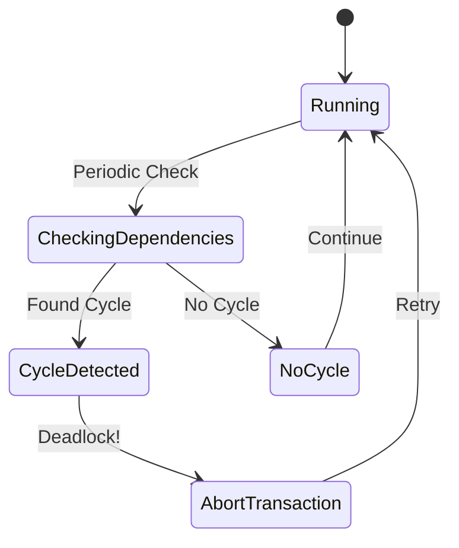
```mermaid
stateDiagram-v2
    [*] --> Running

    Running --> CheckingDependencies: Periodic Check

    CheckingDependencies --> CycleDetected: Found Cycle
    CheckingDependencies --> NoCycle: No Cycle

    NoCycle --> Running: Continue

    CycleDetected --> AbortTransaction: Deadlock!
    AbortTransaction --> Running: Retry
```

## Performance Considerations

### Contention Points

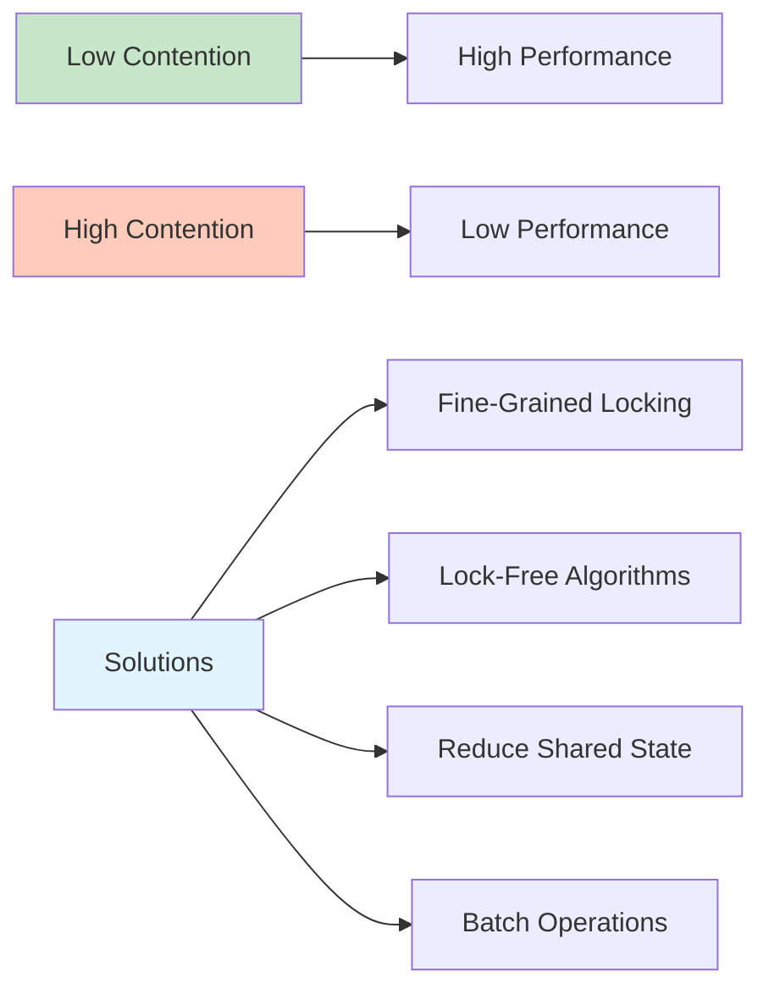
```mermaid
graph LR
    A[Low Contention] --> B[High Performance]
    C[High Contention] --> D[Low Performance]

    E[Solutions] --> F[Fine-Grained Locking]
    E --> G[Lock-Free Algorithms]
    E --> H[Reduce Shared State]
    E --> I[Batch Operations]

    style A fill:#c8e6c9
    style C fill:#ffccbc
    style E fill:#e1f5ff
```

### Cache Line Considerations

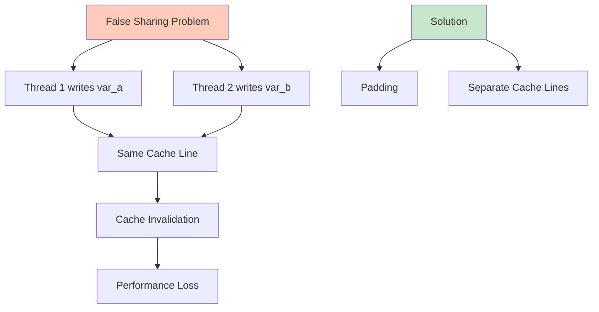
```mermaid
graph TB
    A[False Sharing Problem]

    A --> B[Thread 1 writes var_a]
    A --> C[Thread 2 writes var_b]

    B --> D[Same Cache Line]
    C --> D

    D --> E[Cache Invalidation]
    E --> F[Performance Loss]

    G[Solution] --> H[Padding]
    G --> I[Separate Cache Lines]

    style A fill:#ffccbc
    style G fill:#c8e6c9
```

## Best Practices

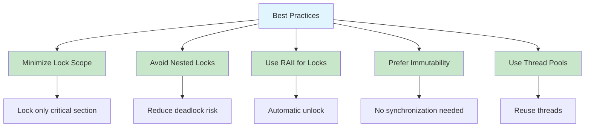
```mermaid
graph TD
    BP[Best Practices] --> BP1[Minimize Lock Scope]
    BP --> BP2[Avoid Nested Locks]
    BP --> BP3[Use RAII for Locks]
    BP --> BP4[Prefer Immutability]
    BP --> BP5[Use Thread Pools]

    BP1 --> EX1[Lock only critical section]
    BP2 --> EX2[Reduce deadlock risk]
    BP3 --> EX3[Automatic unlock]
    BP4 --> EX4[No synchronization needed]
    BP5 --> EX5[Reuse threads]

    style BP fill:#e1f5ff
    style BP1 fill:#c8e6c9
    style BP2 fill:#c8e6c9
    style BP3 fill:#c8e6c9
    style BP4 fill:#c8e6c9
    style BP5 fill:#c8e6c9
```

## Common Pitfalls

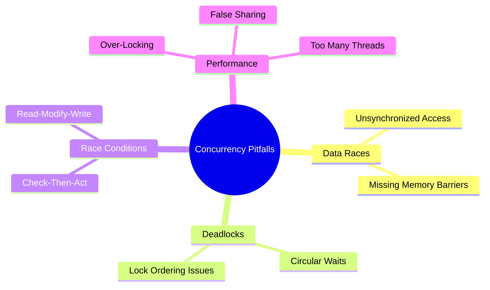
```mermaid
mindmap
  root((Concurrency Pitfalls))
    Data Races
      Unsynchronized Access
      Missing Memory Barriers
    Deadlocks
      Circular Waits
      Lock Ordering Issues
    Race Conditions
      Check-Then-Act
      Read-Modify-Write
    Performance
      Over-Locking
      False Sharing
      Too Many Threads
```

## See Also

- [Tutorial: Advanced Concurrency](../tutorials/advanced-concurrency.md) - Practical examples
- [Data Flow](data-flow.md) - Data movement patterns
- [Performance Optimization](../tutorials/advanced-performance.md) - Optimization techniques
- [Components](components.md) - System architecture
