# CI/CD Pipeline

Continuous Integration and Continuous Deployment setup.

## Overview

This document describes the CI/CD infrastructure and processes for the project.

## CI/CD Architecture

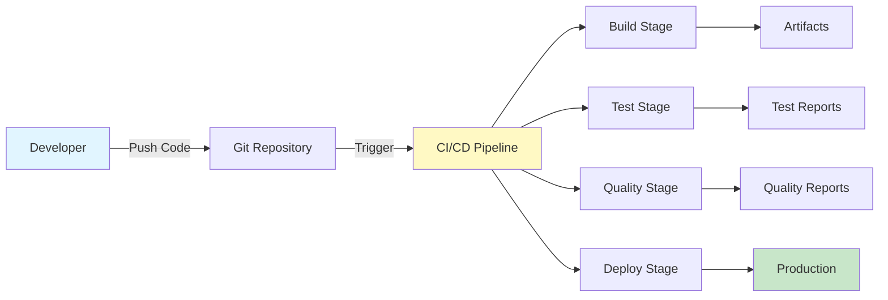

## Pipeline Overview

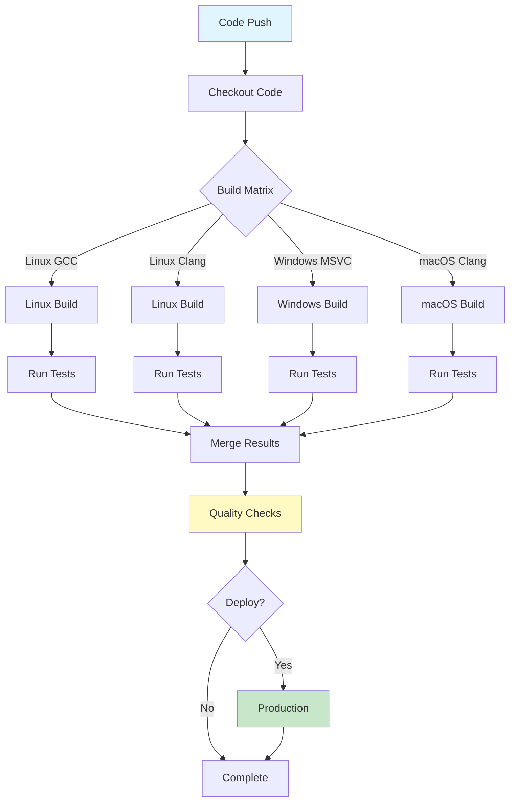

## Build Pipeline

### Build Stages

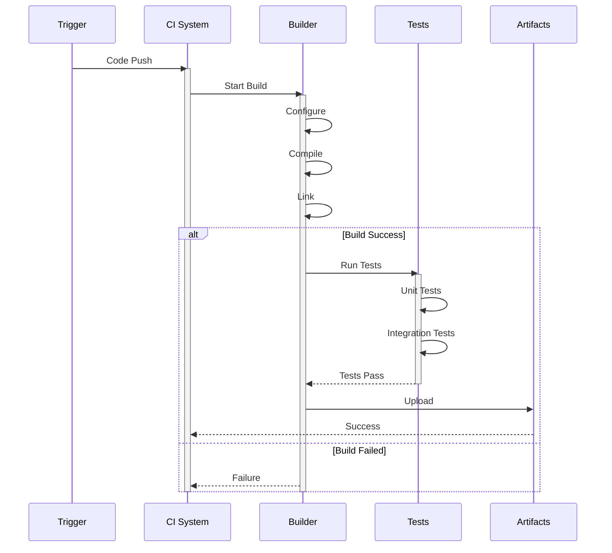

### Build Matrix

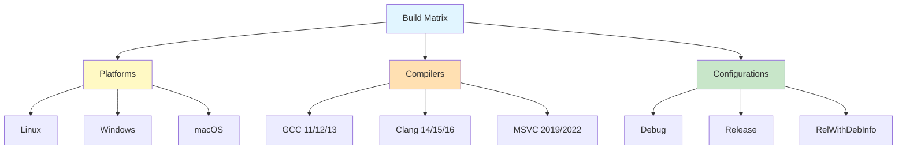

### Build Artifacts Flow

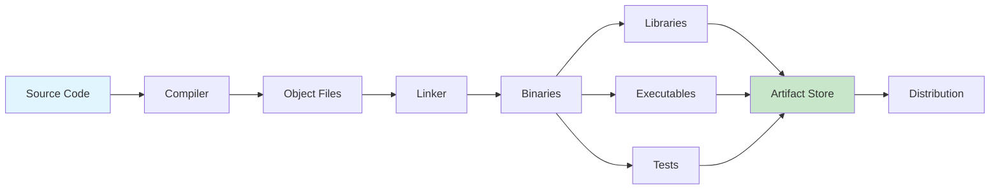

## Test Pipeline

### Test Stages

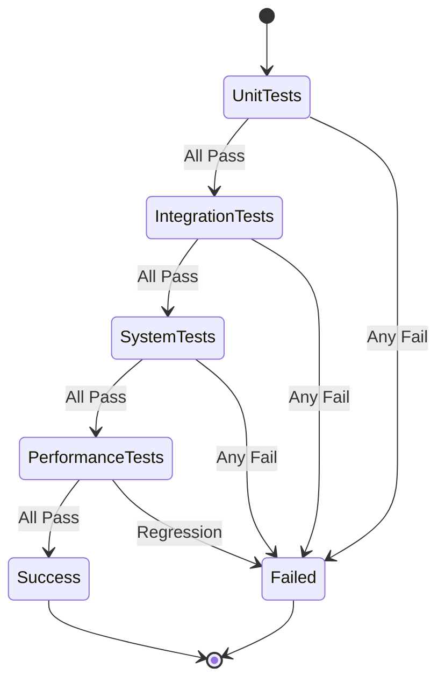

### Test Execution

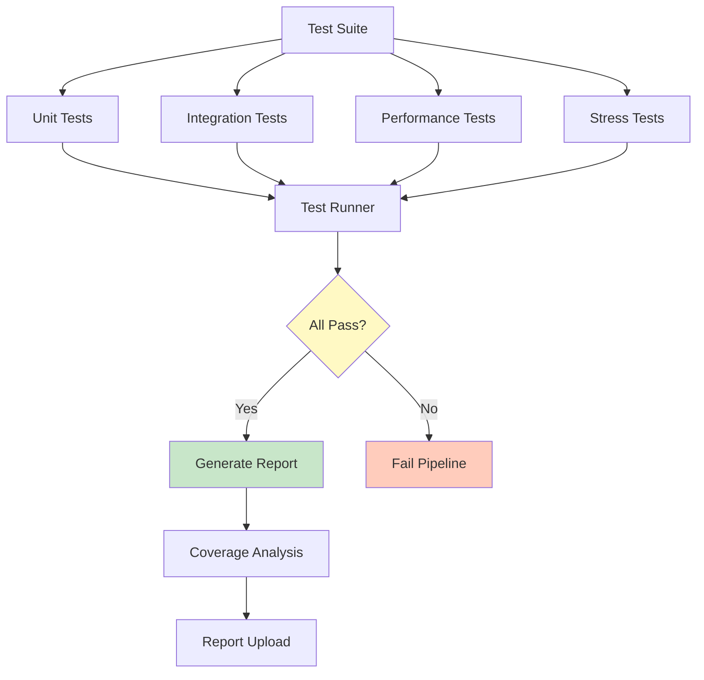

## Code Quality Checks

### Quality Gate

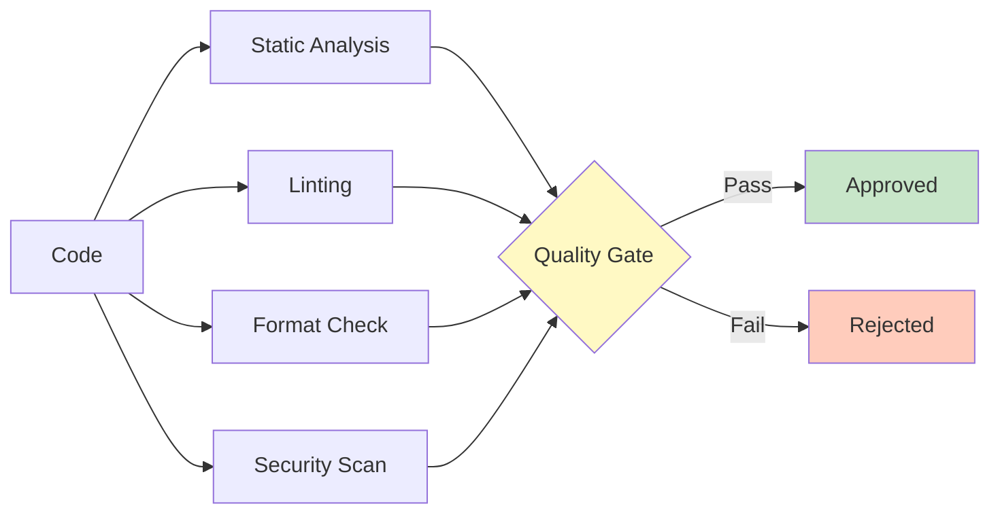

### Analysis Tools

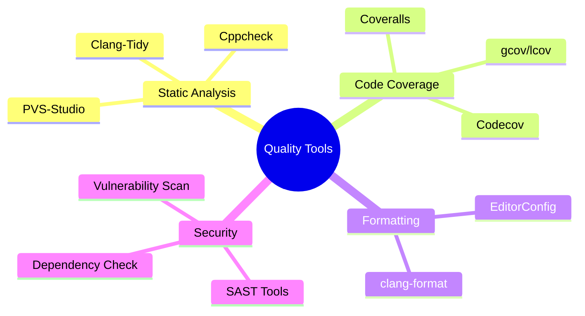

## Deployment Pipeline

### Deployment Flow

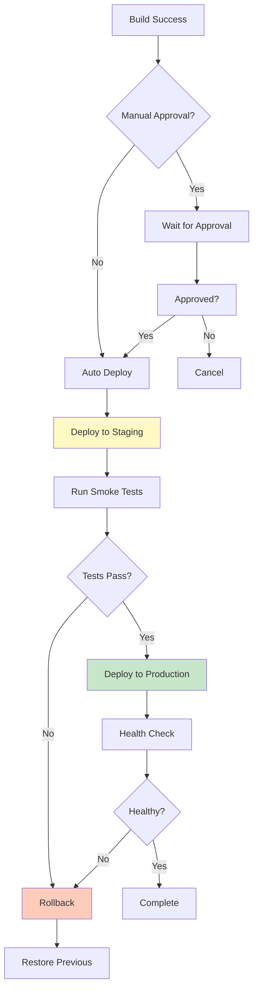

### Environments

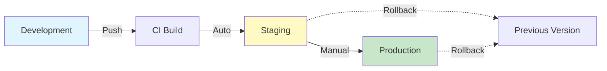

## Release Automation

### Release Process

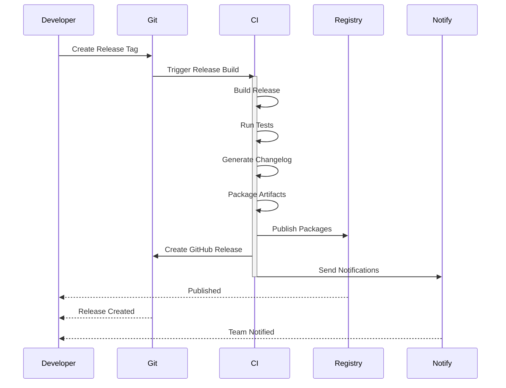

### Version Tagging

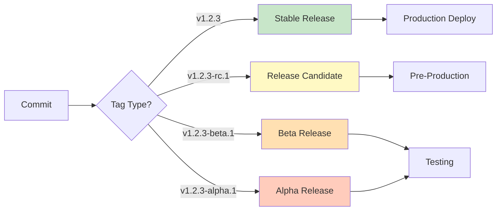

## Monitoring and Alerts

### Monitoring Pipeline

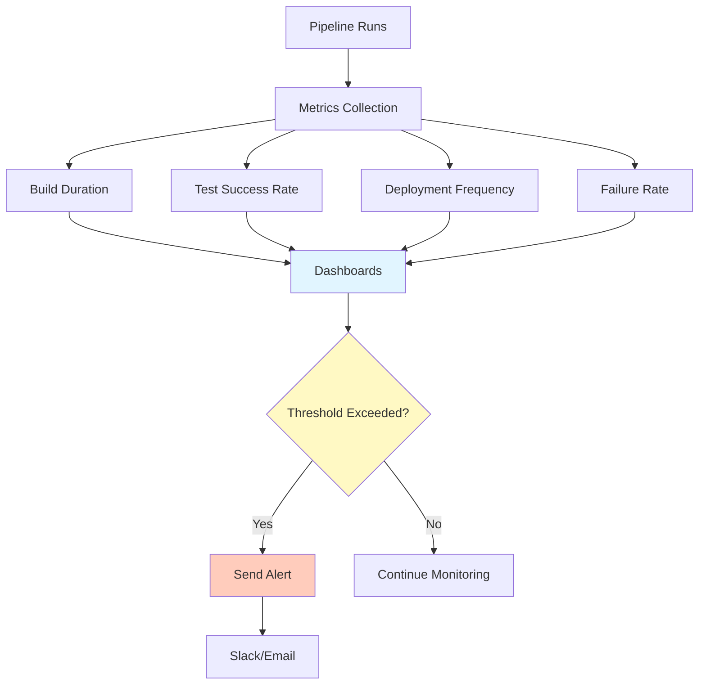

## Configuration

### Pipeline Configuration Structure

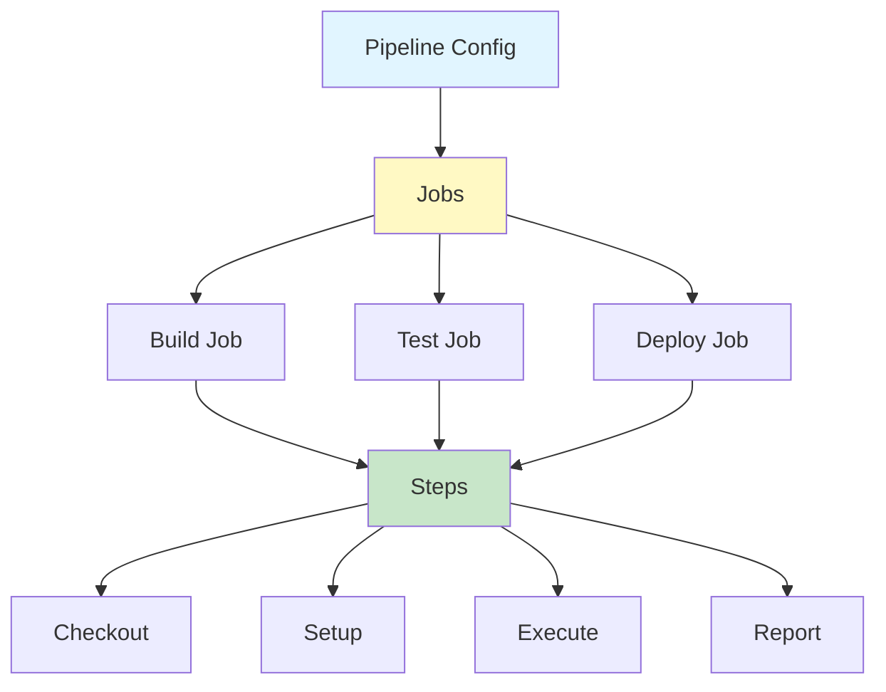

## Performance Metrics

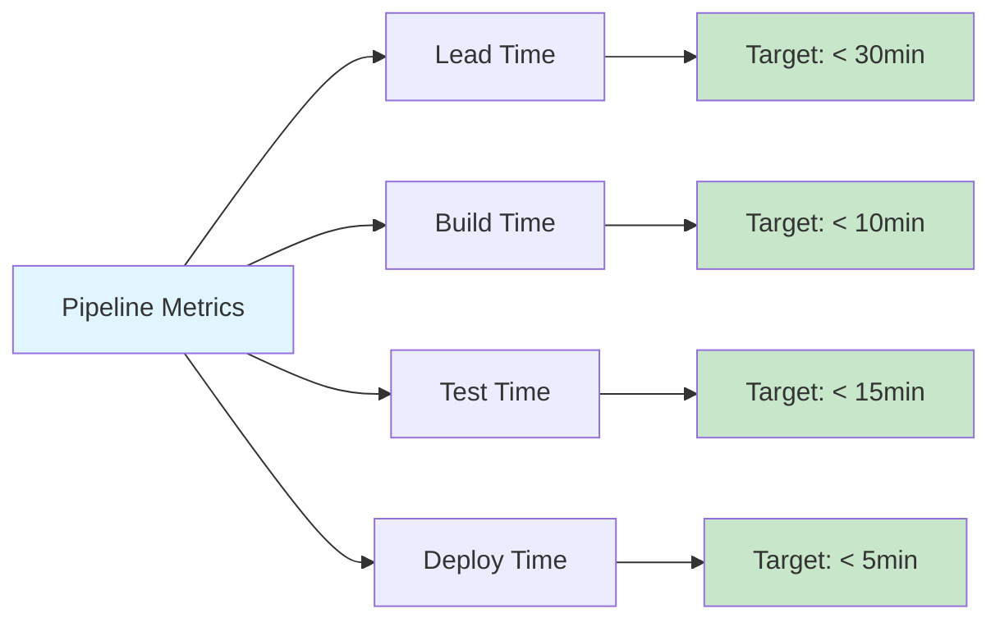

## See Also

- [Testing Guide](testing.md) - Testing strategies
- [Contributing](contributing.md) - Contribution workflow
- [Code Style](code-style.md) - Code standards
