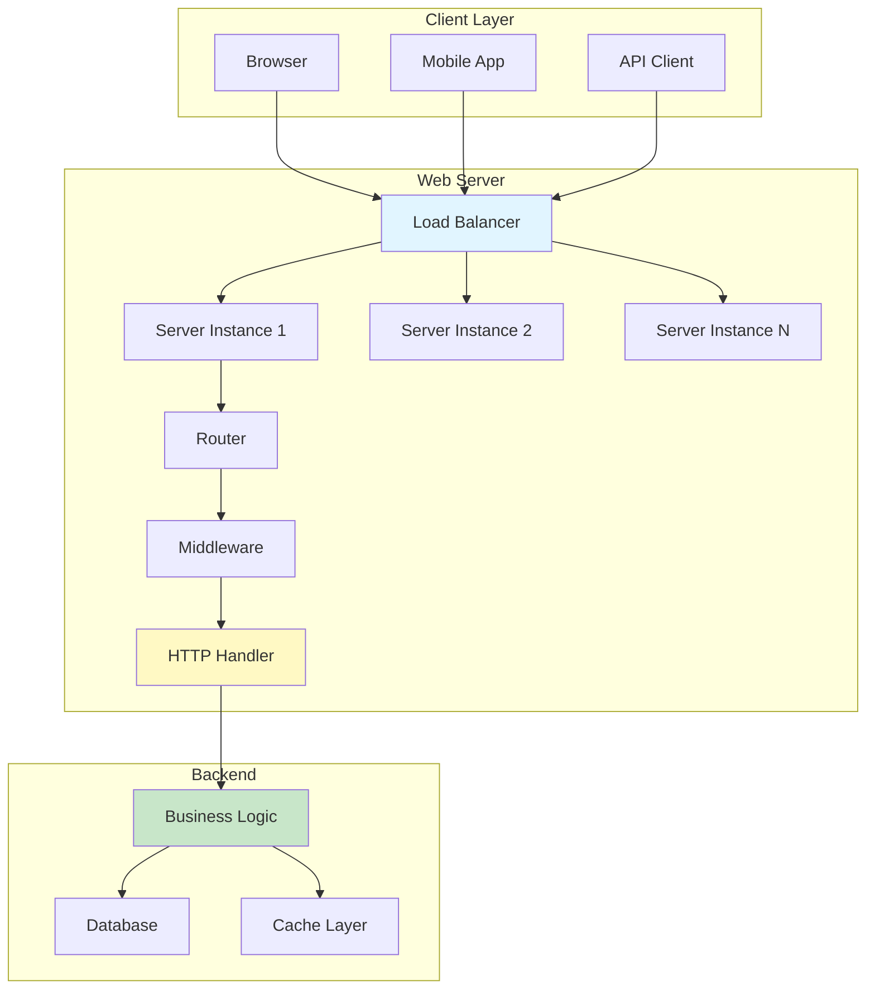
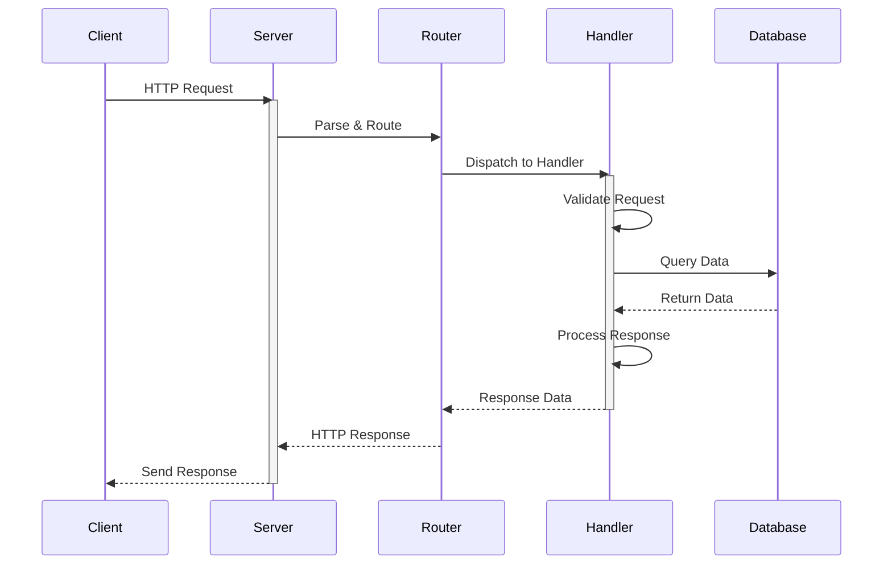
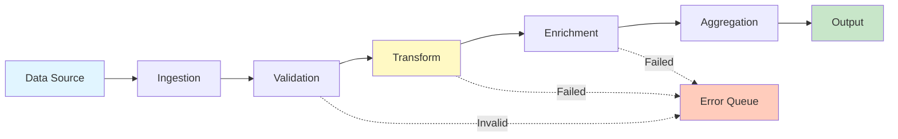
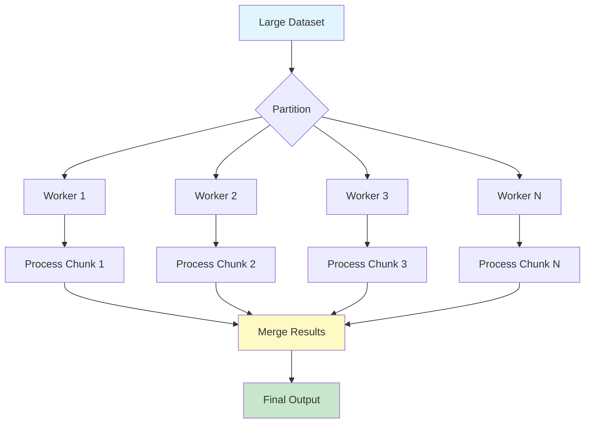
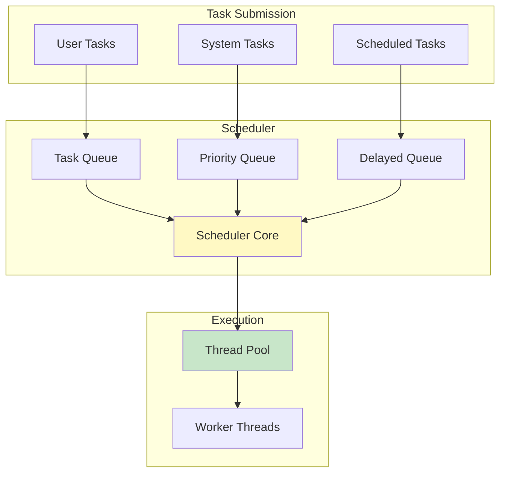
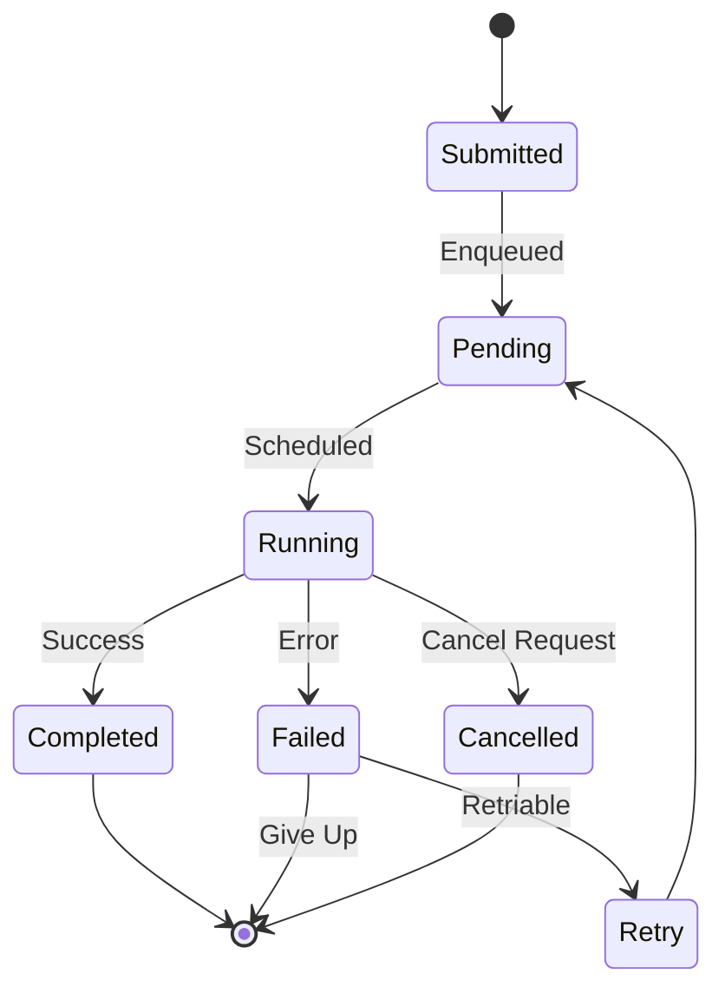
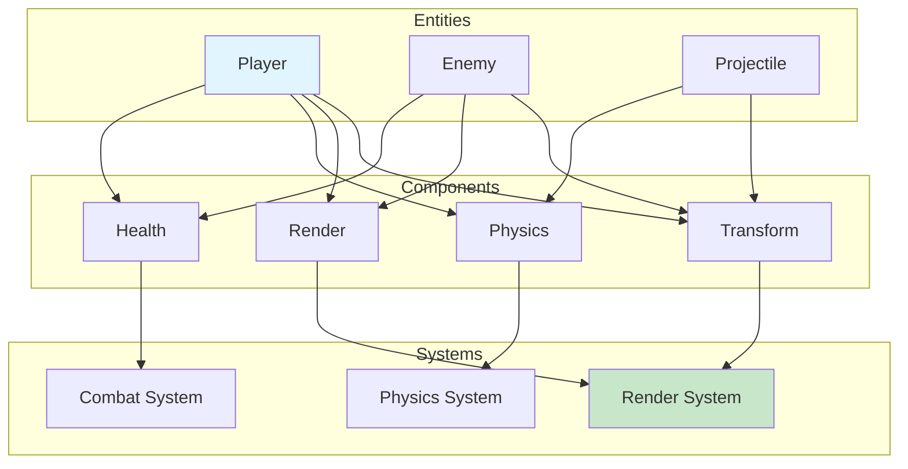
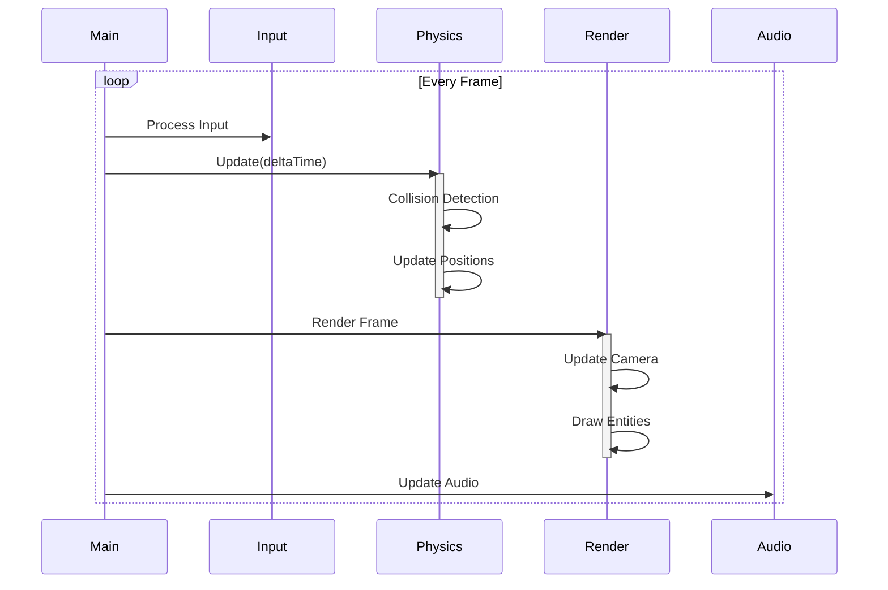
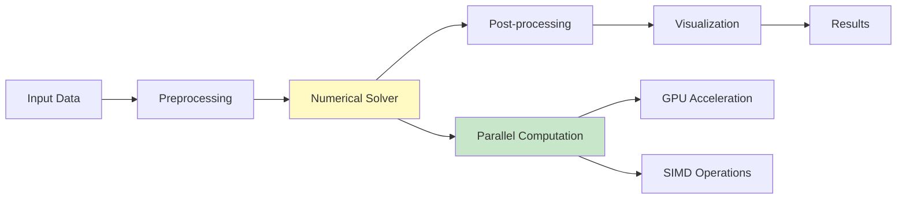

# Use Cases

Real-world use cases and application examples.

## Overview

This page provides complete, real-world examples of applications built with the library.

## Web Server

### Architecture



### Request Flow



### Implementation

```cpp
#include <advlib/net/http_server.hpp>
#include <advlib/async/task.hpp>

using namespace advlib;

class WebServer {
    HttpServer server_;
    Router router_;

public:
    WebServer(uint16_t port) : server_(port) {
        setup_routes();
    }

    void setup_routes() {
        // GET /api/users
        router_.get("/api/users", [](Request req) -> Task<Response> {
            auto users = co_await db::get_all_users();
            co_return Response::json(users);
        });

        // POST /api/users
        router_.post("/api/users", [](Request req) -> Task<Response> {
            auto user = co_await parse_json<User>(req.body());
            auto result = co_await db::create_user(user);
            co_return Response::json(result).status(201);
        });
    }

    void start() {
        server_.listen(router_);
    }
};
```

## Data Processing Pipeline

### Pipeline Architecture



### Parallel Processing



### Implementation

```cpp
#include <advlib/algorithms/parallel.hpp>
#include <advlib/containers/vector.hpp>

using namespace advlib;

class DataPipeline {
public:
    auto process(const Vector<RawData>& input) -> Result<Vector<ProcessedData>, Error> {
        // Step 1: Parallel validation
        auto validated = parallel_filter(input, [](const RawData& d) {
            return validate(d);
        });

        // Step 2: Parallel transformation
        Vector<TransformedData> transformed(validated.size());
        parallel_transform(
            validated.begin(), validated.end(),
            transformed.begin(),
            [](const RawData& d) { return transform(d); }
        );

        // Step 3: Parallel enrichment
        Vector<EnrichedData> enriched(transformed.size());
        parallel_transform(
            transformed.begin(), transformed.end(),
            enriched.begin(),
            [](const TransformedData& d) { return enrich(d); }
        );

        // Step 4: Aggregate
        auto result = parallel_reduce(
            enriched.begin(), enriched.end(),
            ProcessedData{},
            [](const ProcessedData& acc, const EnrichedData& d) {
                return aggregate(acc, d);
            }
        );

        return Ok(result);
    }
};
```

## Concurrent Task Scheduler

### Scheduler Architecture



### Task Lifecycle



### Implementation

```cpp
#include <advlib/concurrency/scheduler.hpp>
#include <advlib/async/task.hpp>

using namespace advlib;

class TaskScheduler {
    Scheduler scheduler_;
    ThreadPool pool_;

public:
    TaskScheduler() : pool_(std::thread::hardware_concurrency()) {}

    // Schedule immediate task
    auto schedule(Task<void> task) -> TaskHandle {
        return scheduler_.submit(std::move(task));
    }

    // Schedule delayed task
    auto schedule_after(Duration delay, Task<void> task) -> TaskHandle {
        return scheduler_.submit_delayed(delay, std::move(task));
    }

    // Schedule recurring task
    auto schedule_recurring(Duration interval, Task<void> task) -> TaskHandle {
        return scheduler_.submit_recurring(interval, std::move(task));
    }

    // Cancel task
    void cancel(TaskHandle handle) {
        scheduler_.cancel(handle);
    }
};
```

## Game Engine Component

### Entity Component System



### Game Loop



## Scientific Computing Application

### Computation Pipeline



### Matrix Operations

```cpp
#include <advlib/math/matrix.hpp>
#include <advlib/algorithms/parallel.hpp>

using namespace advlib;

class ScientificApp {
public:
    // Parallel matrix multiplication
    auto matrix_multiply(const Matrix& A, const Matrix& B) -> Matrix {
        Matrix C(A.rows(), B.cols());

        parallel_for_2d(0, A.rows(), 0, B.cols(), [&](size_t i, size_t j) {
            double sum = 0.0;
            for (size_t k = 0; k < A.cols(); ++k) {
                sum += A(i, k) * B(k, j);
            }
            C(i, j) = sum;
        });

        return C;
    }

    // Solve linear system using iterative method
    auto solve_linear_system(const Matrix& A, const Vector& b)
        -> Result<Vector, Error> {
        // Implementation here
        return Ok(Vector{});
    }
};
```

## See Also

- [Basic Examples](basic-examples.md) - Simple examples
- [Advanced Examples](advanced-examples.md) - Complex examples
- [Design Patterns](design-patterns.md) - Common patterns
- [API Reference](../api-reference/index.md) - Detailed API docs
