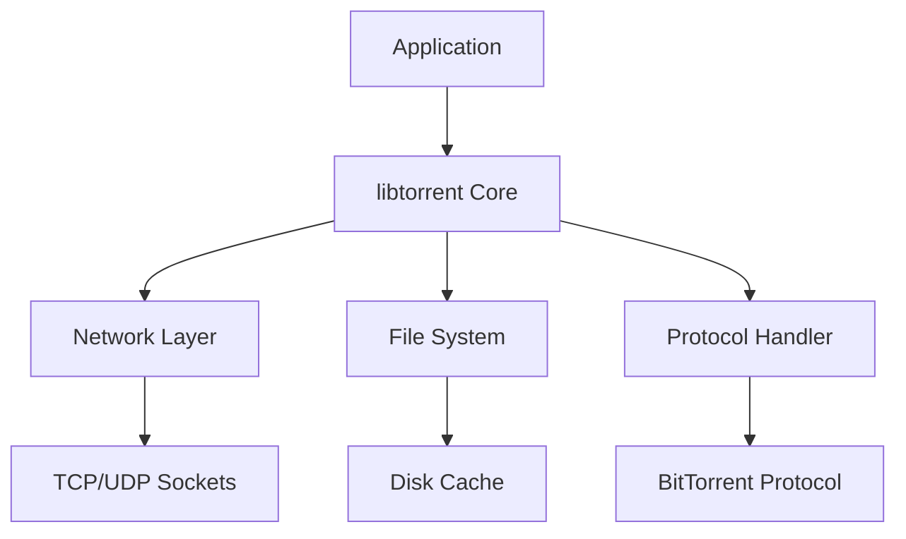

# Getting Started with libtorrent

## Main Purpose

libtorrent is a high-performance C++ library designed to implement BitTorrent protocol clients. It enables developers to build applications that can download and share files using peer-to-peer networking. The library solves challenges related to efficient file sharing, network resilience, and scalability in distributed systems.

## Core Architecture

The project follows a modular design with these key components:

- **Core Library** (`libtorrent/`) - Implements the BitTorrent protocol specifications
- **Bindings** (`bindings/`) - Provides interfaces for different languages (C, Python)
- **Examples** (`examples/`) - Demonstrates practical usage patterns
- **Utilities** (`src/`) - Contains helper functions and data structures

## Entry Points for New Developers

Start your exploration with these resources:

- **Beginner-friendly files**: 
  - `libtorrent.h` (main header file)
  - `bt-get.cpp` (simple example client)
  - `examples/client_test.cpp` (basic usage pattern)

- **Key classes to understand**:
  - `session` - Main entry point for creating torrent sessions
  - `torrent_handle` - Represents a single torrent download
  - `alert` - Event notification system

Common workflow:
1. Create a session with configuration settings
2. Add torrents using magnet links or .torrent files
3. Process alerts to monitor download progress
4. Manage resources and shutdown gracefully

## Technology Stack

- **C++ Standard**: C++17 (with some C++14 features)
- **Key Libraries**:
  - Boost (for threading, filesystem, etc.)
  - OpenSSL (for encryption support)
  - zlib (for compression)
- **Build System**: CMake
- **Testing Framework**: Google Test

For more details, explore:
- [Main header file](libtorrent/libtorrent.h)
- [Python bindings](libtorrent/bindings/python/src/)
- [Example applications](examples/)