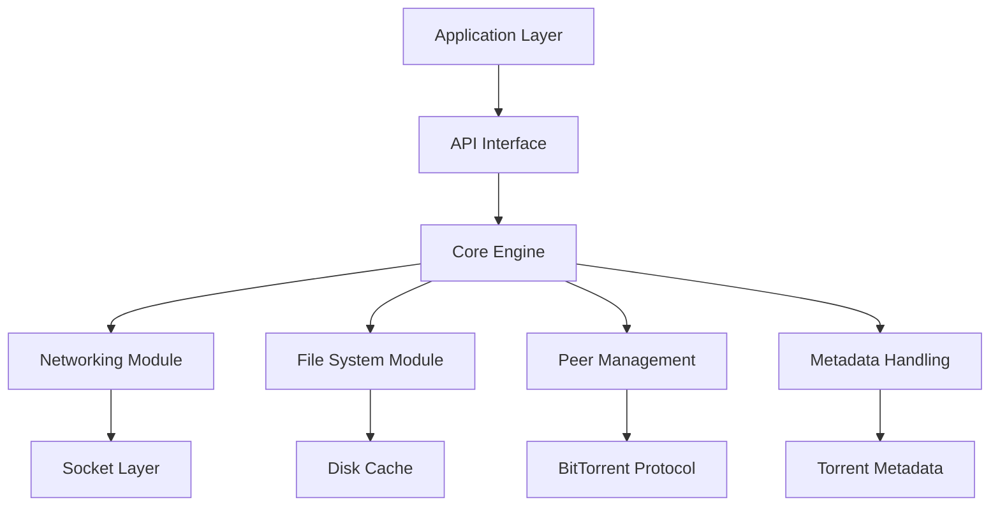
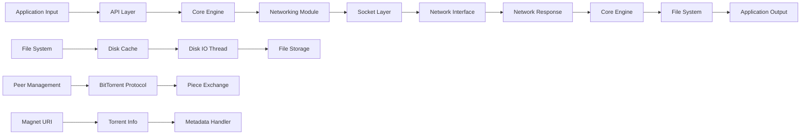
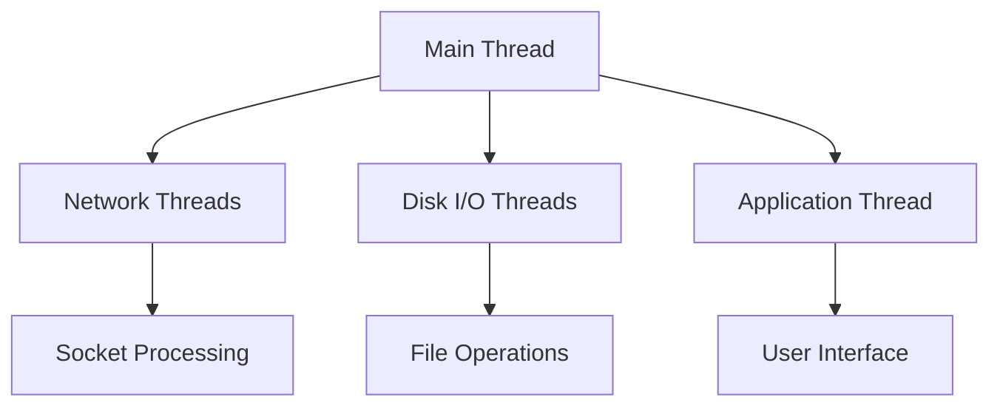

# libtorrent Architecture Documentation

## 1. Architecture Overview

The libtorrent project follows a **monolithic architecture** with strong emphasis on modularity through well-defined components and interfaces. This design prioritizes performance, portability, and maintainability across multiple platforms. The core architectural principle is **separation of concerns**, where networking, file management, peer communication, and metadata handling are encapsulated in distinct modules.

Key architectural decisions include:
- **Event-driven architecture** for handling asynchronous operations
- **Component-based design** with clear interfaces between subsystems
- **Cross-platform compatibility** through abstraction layers
- **Extensibility** via plugin-like mechanisms for trackers, encryption, etc.
- **Resource efficiency** with careful memory management and minimal overhead

The system is designed to handle high-concurrency peer-to-peer operations while maintaining thread safety and responsiveness. This architecture enables libtorrent to serve as a robust foundation for various applications requiring torrent functionality.



## 2. Component Breakdown

### Core Engine
**Purpose**: Central coordination of all torrent operations, managing state and orchestrating component interactions.

**Key Classes/Interfaces**:
- `session`: Main entry point for creating and managing torrents
- `torrent_handle`: Reference to a specific torrent session
- `alert_manager`: Handles system alerts and notifications

```cpp
class session {
public:
    torrent_handle add_torrent(add_torrent_params const& params);
    void pause();
    void resume();
};
```

**Interactions**: 
- Receives requests from application layer via API interface
- Coordinates with networking, file system, and peer management modules
- Publishes alerts to alert manager

### Networking Module
**Purpose**: Handles all network communication including TCP/UDP sockets, protocol encryption, and connection management.

**Key Classes/Interfaces**:
- `socket`: Abstract socket interface for cross-platform compatibility
- `tcp_connection`: Manages TCP connections with peers
- `udp_socket`: Handles UDP traffic for DHT and tracker communications

```cpp
class tcp_connection : public socket {
public:
    void send(buffer const& data);
    void close();
};
```

**Interactions**: 
- Communicates with core engine to establish connections
- Interfaces with peer management for connection requests
- Works with encryption module for secure communication

### File System Module
**Purpose**: Manages file operations including reading, writing, and caching torrent files.

**Key Classes/Interfaces**:
- `file_storage`: Represents the structure of a torrent's files
- `disk_io_thread`: Handles asynchronous disk I/O operations
- `cache`: Memory-based cache for frequently accessed data

```cpp
class disk_io_thread {
public:
    void async_read(file_slice const& slice, disk_observer* observer);
    void async_write(file_slice const& slice, disk_observer* observer);
};
```

**Interactions**: 
- Receives file operations from core engine
- Communicates with cache module for data retrieval
- Interfaces with peer management for piece verification

### Peer Management Module
**Purpose**: Manages peer connections, piece exchange, and protocol negotiation.

**Key Classes/Interfaces**:
- `peer_connection`: Represents a connection to a single peer
- `bitfield`: Tracks which pieces each peer has
- `piece_picker`: Determines which pieces to request from peers

```cpp
class peer_connection : public socket {
public:
    void send_request(piece_block const& block);
    void handle_piece(piece_block const& block);
};
```

**Interactions**: 
- Receives connection requests from networking module
- Communicates with file system for piece verification
- Updates bitfield and piece picker based on peer responses

### Metadata Handling Module
**Purpose**: Processes torrent metadata including .torrent files, magnet links, and tracker information.

**Key Classes/Interfaces**:
- `torrent_info`: Contains all metadata about a specific torrent
- `create_torrent`: Generates new torrent files from directory structures
- `magnet_uri`: Parses and generates magnet URIs

```cpp
class create_torrent {
public:
    void add_file(std::string const& path, std::string const& name);
    torrent_info generate();
};
```

**Interactions**: 
- Receives metadata from application layer via API interface
- Provides information to core engine for session creation
- Interfaces with file system module during torrent generation

## 3. Data Flow

The data flow in libtorrent follows a well-defined pattern across multiple stages:



**Key Data Structures**:
- `torrent_info`: Contains metadata about a torrent including file list, piece hashes, and tracker URLs
- `piece_block`: Represents a block of data (typically 16KB) that can be transferred between peers
- `file_slice`: Defines the range of bytes to read/write from/to disk files
- `alert`: System notifications for events like connection established, download complete, etc.

**Data Transformation Points**:
1. **Torrent File Parsing**: Converts .torrent file format into internal `torrent_info` structure
2. **Magnet URI Processing**: Extracts info_hash and tracker information from magnet links
3. **Piece Verification**: Compares downloaded pieces with expected hashes in torrent metadata
4. **File Writing**: Transforms piece data into actual files on disk

## 4. Design Patterns

### Observer Pattern
**Application**: Used extensively for alert notifications throughout the system.

```cpp
class alert_manager {
public:
    void add_alert(alert* a);
    std::vector<alert*> get_pending_alerts();
};

// Alert classes inherit from base alert class
class peer_connected_alert : public alert {
    // Specific implementation details
};
```

**Why**: Enables decoupled communication between components, allowing the system to notify interested parties of events without direct dependencies.

### Factory Pattern
**Application**: Used for creating torrent sessions and other core objects.

```cpp
class session {
public:
    static std::unique_ptr<session> create();
};

// Implementation in source file
std::unique_ptr<session> session::create() {
    return std::make_unique<session>();
}
```

**Why**: Provides controlled instantiation of complex objects, allowing for future extension with different session types.

### Singleton Pattern
**Application**: Used for global configuration and system-wide services.

```cpp
class settings_pack {
public:
    static settings_pack& instance();
    
private:
    // Private constructor to prevent direct instantiation
    settings_pack() = default;
};
```

**Why**: Ensures a single point of control for system configuration, preventing inconsistent state across different parts of the application.

### Strategy Pattern
**Application**: Used in encryption and compression modules where different algorithms can be selected at runtime.

```cpp
class encryption {
public:
    virtual void encrypt(buffer& data) = 0;
    virtual void decrypt(buffer& data) = 0;
};

// Concrete implementations
class aes_encryption : public encryption { /* ... */ };
class none_encryption : public encryption { /* ... */ };
```

**Why**: Allows runtime selection of different algorithms without modifying core code, enhancing extensibility.

## 5. Threading and Concurrency

### Threading Model
libtorrent employs a **multi-threaded architecture** with distinct thread pools for different operations:



The system uses:
- **Worker threads** for network operations (typically 2-4)
- **Dedicated disk thread** for file I/O
- **Main application thread** for user interface and control flow

### Synchronization Mechanisms
**Key Components**:
1. **Mutexes**: Used to protect shared data structures like the torrent list and peer connections.
   ```cpp
   std::mutex m_mutex;
   ```

2. **Condition Variables**: For signaling between threads, particularly in disk I/O operations.
   ```cpp
   std::condition_variable m_condition;
   ```

3. **Atomic Operations**: Used for thread-safe counters and flags to minimize locking overhead.

4. **Read-Write Locks**: Applied to data structures that are frequently read but infrequently modified.

### Concurrent Data Structures
**Key Structures**:
1. `unordered_map` with appropriate synchronization: Used for storing torrent sessions and peer connections.
2. `deque`: For managing pending network operations and disk I/O requests.
3. `shared_ptr`: For safe reference counting across threads, particularly in alert management.

The system employs **lock-free programming techniques** where possible to minimize contention, especially in high-performance networking paths. Critical sections are kept as small as possible, with most data access occurring through thread-safe interfaces rather than direct manipulation of shared state.