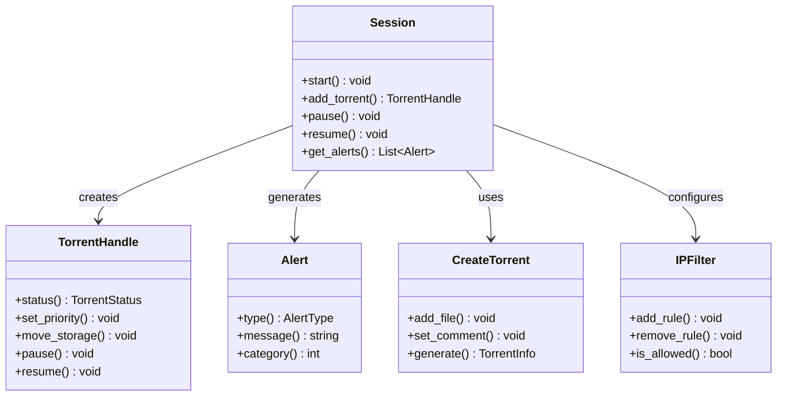
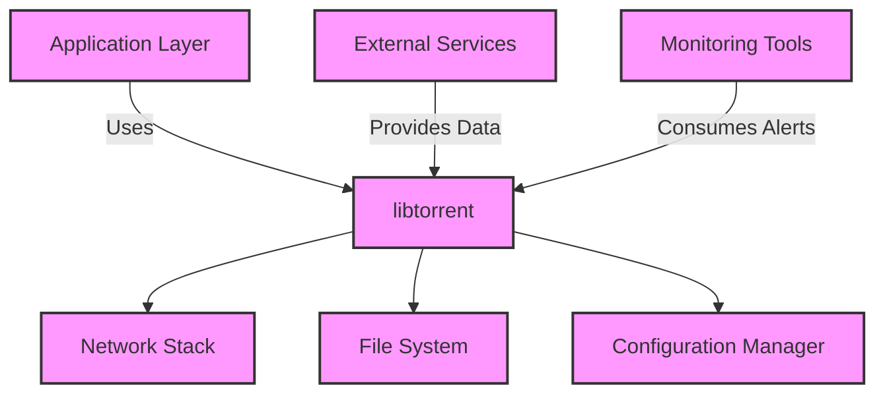

# libtorrent Module Documentation

## 1. Overview

The `libtorrent` module provides a comprehensive C++ library for implementing BitTorrent protocol clients. It enables applications to download and share files using the peer-to-peer file sharing model defined by the BitTorrent specification. The primary purpose of this module is to abstract the complexities of network communication, torrent parsing, piece management, and peer coordination into a reusable, high-performance framework.

This module solves critical problems in distributed file sharing systems, including efficient data transfer across unreliable networks, bandwidth optimization through intelligent downloading strategies, and robust error handling for large-scale content distribution. It fits centrally within the overall system as the core networking component that powers file sharing functionality, serving as the foundation for higher-level applications like media players or download managers.

The module supports both C and Python bindings, making it accessible to a wide range of developers while maintaining high performance through its native C++ implementation. Its modular design allows integration with various application layers while providing fine-grained control over torrent operations.

## 2. Main Classes and Responsibilities



### Session
- **Brief Description**: Manages the overall BitTorrent session, coordinating multiple torrents and network operations.
- **Primary Responsibilities**: 
  - Maintains global state for all active torrents
  - Handles network communication and peer connections
  - Processes alerts and events from the system
  - Manages configuration settings and resource allocation
- **Key Methods**: `start()`, `add_torrent()`, `pause()`, `resume()`, `get_alerts()`
- **Relationships**: Creates `TorrentHandle` instances, generates `Alert` objects, uses `CreateTorrent` for new torrents, configures `IPFilter`

### TorrentHandle
- **Brief Description**: Represents a single torrent being downloaded or uploaded.
- **Primary Responsibilities**:
  - Tracks download/upload progress and status
  - Manages piece selection and priority
  - Controls local storage operations
  - Handles peer connections for this specific torrent
- **Key Methods**: `status()`, `set_priority()`, `move_storage()`, `pause()`, `resume()`
- **Relationships**: Created by `Session`, receives alerts from the system, interacts with file storage components

### Alert
- **Brief Description**: Represents notifications and events generated by the libtorrent system.
- **Primary Responsibilities**:
  - Encapsulates various types of system messages (errors, warnings, status updates)
  - Provides structured access to event information
  - Facilitates communication between different subsystems
- **Key Methods**: `type()`, `message()`, `category()`
- **Relationships**: Generated by `Session` and other components, consumed by application code

### CreateTorrent
- **Brief Description**: Helper class for creating new torrent files.
- **Primary Responsibilities**:
  - Builds torrent metadata from file system data
  - Generates appropriate piece hashes
  - Creates the final torrent file structure
- **Key Methods**: `add_file()`, `set_comment()`, `generate()`
- **Relationships**: Used by applications to create torrents, produces `TorrentInfo` objects

### IPFilter
- **Brief Description**: Manages network access control for peers.
- **Primary Responsibilities**:
  - Implements IP address filtering rules
  - Controls which peers can connect
  - Provides security and bandwidth management
- **Key Methods**: `add_rule()`, `remove_rule()`, `is_allowed()`
- **Relationships**: Configured by `Session`, used during peer connection attempts

## 3. Module Interactions



The `libtorrent` module interacts with several other components in the system:

**Dependencies on Other Modules**:
- **Network Stack**: For TCP/UDP communication and peer connections
- **File System**: To read/write torrent files, piece data, and metadata
- **Configuration Manager**: For loading user preferences and session settings
- **Security Module**: For encryption protocols and authentication

**Modules Dependent on libtorrent**:
- **Media Player**: Uses the library to download media content
- **Download Manager**: Provides a user interface for torrent operations
- **Analytics Service**: Consumes alerts and usage data from the module

**Key Interfaces Exposed**:
- C API (`libtorrent.h`) for direct integration with C applications
- Python bindings for scripting and rapid development
- Event-driven alert system for real-time notifications
- Configuration interfaces for runtime adjustments

**Data Flow**:
1. **Input**: Torrent files, magnet links, configuration settings enter the module through application interfaces
2. **Processing**: The library parses torrents, establishes peer connections, manages piece downloads, and handles network communication
3. **Output**: Downloaded content is written to file system, alerts are generated for monitoring systems, and status updates are provided to applications

## 4. Typical Usage Scenarios

### Scenario 1: Basic Torrent Download
```python
import libtorrent as lt

# Create session
ses = lt.session()
ses.listen_on(6881, 6891)

# Add torrent file
with open("example.torrent", "rb") as f:
    info = lt.torrent_info(f.read())
handle = ses.add_torrent(info)

# Monitor download progress
while not handle.is_seed():
    print(f"Progress: {handle.status().progress * 100:.2f}%")
    # Process alerts if needed
    for a in ses.pop_alerts():
        print(a.message())

print("Download complete!")
```

### Scenario 2: Creating and Seeding a Torrent
```python
import libtorrent as lt

# Create torrent metadata
creator = lt.create_torrent()
creator.add_file("/path/to/file.txt", 1024)  # Add file with size
creator.set_comment("My first torrent")
creator.set_creator("libtorrent")

# Generate torrent file
lt.generate_torrent(creator)
with open("my_torrent.torrent", "wb") as f:
    f.write(lt.bencode(creator.generate()))

# Start seeding
ses = lt.session()
handle = ses.add_torrent(creator.generate())
print(f"Seeding started with info hash: {handle.info_hash()}")
```

### Scenario 3: Advanced Configuration and Monitoring
```cpp
#include "libtorrent.h"

// Configure session with custom settings
lt::session ses(lt::settings_pack());
ses.listen_on({6881, 6891});
ses.set_alert_mask(lt::alert::error_notification | lt::alert::status_notification);

// Add torrent with specific options
lt::add_torrent_params params;
params.ti = std::make_shared<lt::torrent_info>("example.torrent");
params.save_path = "/downloads/";
lt::torrent_handle handle = ses.add_torrent(params);

// Monitor and control download
while (!handle.is_seed()) {
    lt::alert const* a = ses.wait_for_alert(lt::seconds(5));
    if (a) {
        std::cout << "Alert: " << a->message() << std::endl;
        
        // Check for errors or status updates
        if (auto e = lt::alert_cast<lt::error_alert>(a)) {
            std::cerr << "Error: " << e->what() << std::endl;
        }
    }
}
```

## 5. Design Patterns and Principles

The `libtorrent` module implements several key design patterns to achieve its goals of performance, flexibility, and maintainability:

**Design Patterns Used**:
- **Observer Pattern**: Implemented through the alert system where components subscribe to specific types of events
- **Factory Pattern**: Used in creating torrent handles and other objects from session instances
- **Builder Pattern**: Applied in `CreateTorrent` class for constructing complex torrent metadata
- **Singleton Pattern**: The `Session` acts as a central coordinator with global state management

**Key Architectural Decisions**:
1. **Event-Driven Architecture**: The alert system provides non-blocking notifications, allowing applications to respond to events without polling
2. **Component-Based Design**: Separation of concerns between session management, torrent handling, and network operations
3. **Resource Pooling**: Efficient memory management for piece data and peer connections
4. **Asynchronous Processing**: All network operations run in background threads with proper synchronization

**Why This Approach Was Chosen**:
The event-driven model was selected to handle the high-frequency nature of BitTorrent protocol events while maintaining responsiveness. The component-based architecture allows for modular development and testing, making it easier to maintain and extend the library. Resource pooling ensures optimal memory usage during large file transfers, which is critical for handling multiple torrents simultaneously.

This design enables the module to scale efficiently across different platforms and use cases, from lightweight applications on embedded systems to high-performance download managers on desktop computers. The separation of concerns also facilitates integration with various application frameworks while maintaining a consistent API surface.