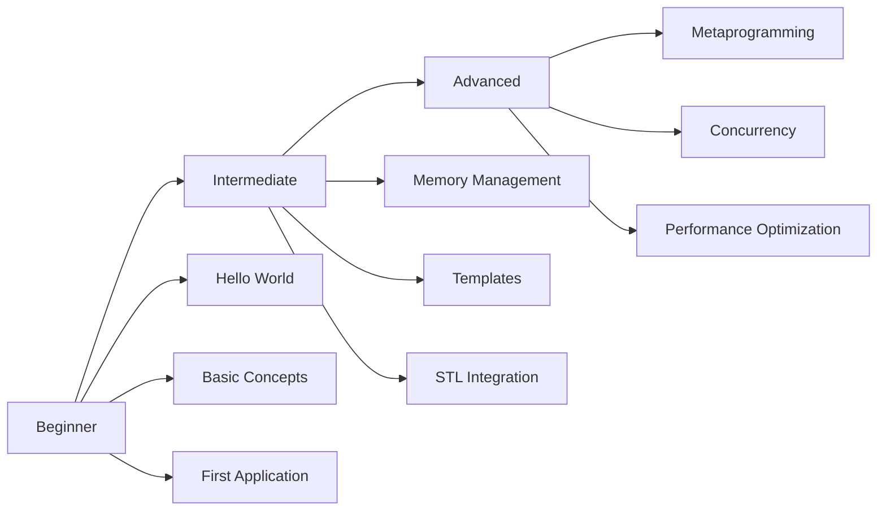

# Tutorials

Willkommen zu den C++ Advanced Library Tutorials! Hier findest du schrittweise Anleitungen für alle Erfahrungsstufen.

## Lernpfad-Übersicht



## :beginner: Beginner Tutorials

Perfekt für Einsteiger in die Library:

### [Hello World](beginner-hello-world.md)
**Zeit: 10 Minuten**

Dein erstes Programm mit AdvLib. Lerne die Grundstruktur kennen.

- Projekt-Setup
- Header einbinden
- Basis-Funktionen nutzen

### [Basic Concepts](beginner-concepts.md)
**Zeit: 30 Minuten**

Verstehe die fundamentalen Konzepte der Library.

- Namespaces und Module
- Error Handling mit Result
- Optional Types
- Smart Pointers

### [First Application](beginner-first-app.md)
**Zeit: 45 Minuten**

Erstelle eine vollständige kleine Anwendung.

- Projekt-Struktur
- Logging System
- Konfiguration
- Error Handling

## :muscle: Intermediate Tutorials

Für Entwickler mit Grundkenntnissen:

### [Memory Management](intermediate-memory.md)
**Zeit: 1 Stunde**

Fortgeschrittene Speicherverwaltung und Custom Allocators.

- Custom Allocators
- Memory Pools
- Object Lifetime Management
- RAII Patterns

### [Template Programming](intermediate-templates.md)
**Zeit: 1 Stunde**

Nutze Templates und Generic Programming.

- Function Templates
- Class Templates
- Template Specialization
- SFINAE und Concepts

### [STL Integration](intermediate-stl.md)
**Zeit: 45 Minuten**

Nahtlose Integration mit der C++ Standard Library.

- Custom Containers
- Iterator Patterns
- Algorithm Integration
- Range Adaptors

## :rocket: Advanced Tutorials

Für erfahrene C++ Entwickler:

### [Metaprogramming](advanced-metaprogramming.md)
**Zeit: 2 Stunden**

Template Metaprogramming und Compile-Time Computing.

- Type Traits
- Compile-Time Computation
- Expression Templates
- Policy-Based Design

### [Concurrency](advanced-concurrency.md)
**Zeit: 2 Stunden**

Multithreading, Async/Await und parallele Algorithmen.

- Thread Pools
- Async/Await Pattern
- Lock-Free Data Structures
- Parallel Algorithms

### [Performance Optimization](advanced-performance.md)
**Zeit: 1.5 Stunden**

Low-Level Optimierungen und Performance-Tuning.

- SIMD Operations
- Cache Optimization
- Branch Prediction
- Profiling und Benchmarking

## Tutorial-Format

Alle Tutorials folgen diesem Format:

!!! info "Tutorial-Struktur"
    - **Lernziele**: Was du lernen wirst
    - **Voraussetzungen**: Benötigtes Vorwissen
    - **Code-Beispiele**: Vollständige, lauffähige Beispiele
    - **Erklärungen**: Schritt-für-Schritt Anleitungen
    - **Übungen**: Aufgaben zum Selbermachen
    - **Zusammenfassung**: Key Takeaways

## Interaktive Features

### Code-Beispiele

Alle Code-Beispiele können kopiert und direkt ausgeführt werden:

```cpp
#include <advlib/core.hpp>

int main() {
    advlib::log::info("Ready to learn!");
    return 0;
}
```

### Try-It-Yourself Abschnitte

!!! example "Versuche es selbst"
    Praktische Aufgaben zum Ausprobieren während des Tutorials.

### Tipps und Tricks

!!! tip "Pro-Tipp"
    Nützliche Hinweise und Best Practices.

### Häufige Fehler

!!! warning "Vorsicht"
    Typische Fehler und wie man sie vermeidet.

### Tiefes Wissen

!!! note "Deep Dive"
    Zusätzliche Informationen für Interessierte.

## Voraussetzungen

### Für Beginner-Tutorials

- Grundlegende C++ Kenntnisse (Variablen, Funktionen, Klassen)
- Compiler-Installation (siehe [Installation](../getting-started/installation.md))
- Basis-Kenntnisse der Kommandozeile

### Für Intermediate-Tutorials

- Abgeschlossene Beginner-Tutorials oder äquivalente Kenntnisse
- Vertrautheit mit STL Containers und Algorithms
- Verständnis von Pointern und References

### Für Advanced-Tutorials

- Abgeschlossene Intermediate-Tutorials
- Solides Verständnis von C++ Templates
- Erfahrung mit Multi-Threading
- Kenntnisse in Performance-Analyse

## Lern-Ressourcen

### Begleitende Materialien

- **Beispiel-Code**: Alle Tutorial-Beispiele sind im [GitHub Repository](https://github.com/youruser/advlib-examples/tree/main/tutorials)
- **Video-Tutorials**: [YouTube Playlist](https://youtube.com/advlib)
- **Interaktive Übungen**: [Compiler Explorer](https://godbolt.org/)

### Community

- **Discord**: Stelle Fragen in unserem [Discord Server](https://discord.gg/advlib)
- **Forum**: Diskutiere im [Community Forum](https://forum.advlib.io)
- **Stack Overflow**: Tag mit `advancedlib`

## Empfohlener Lernplan

### Woche 1: Grundlagen
- Tag 1-2: Beginner Tutorials
- Tag 3-5: Erste eigene Projekte
- Tag 6-7: Review und Übungen

### Woche 2-3: Fortgeschritten
- Woche 2: Intermediate Tutorials
- Woche 3: Eigene Intermediate-Projekte

### Woche 4+: Expert
- Advanced Tutorials durcharbeiten
- Komplexe Projekte umsetzen
- Zur Community beitragen

## Nächste Schritte

!!! success "Bereit loszulegen?"
    Beginne mit dem [Hello World Tutorial](beginner-hello-world.md) und arbeite dich durch die Tutorials!

Oder:

- Springe direkt zu einem spezifischen Thema
- Schaue dir [Beispiele](../examples/index.md) an
- Erkunde die [API Reference](../api-reference/index.md)
