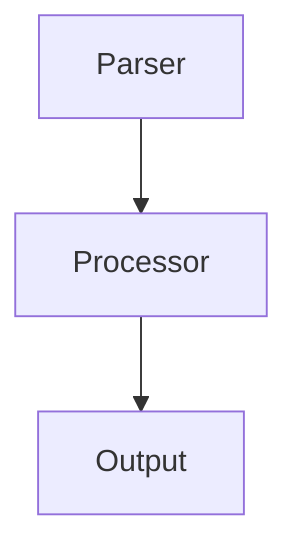
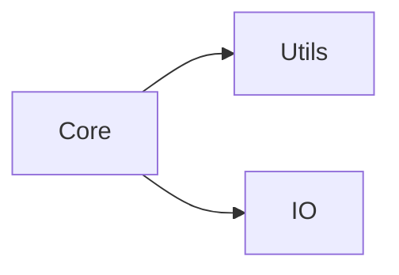

# Quick Start Guide

Generiere in 5 Minuten intelligente C++-Dokumentation mit LLMs!

## 1. Installation (1 Minute)

```bash
cd plugins/mkdocs-llm-autodoc
pip install -e .
```

## 2. API-Key setzen (1 Minute)

### Option A: Anthropic Claude (empfohlen)

```bash
export ANTHROPIC_API_KEY="sk-ant-..."
```

### Option B: OpenAI

```bash
export OPENAI_API_KEY="sk-..."
```

### Option C: Ollama (lokal, kostenlos)

```bash
# Ollama installieren von ollama.ai
ollama pull llama3
ollama serve
```

### Option D: LM Studio (lokal mit GUI, kostenlos)

```bash
# 1. LM Studio von lmstudio.ai herunterladen
# 2. Modell herunterladen (z.B. DeepSeek Coder)
# 3. Im LM Studio: Developer → Start Server
```

## 3. MkDocs konfigurieren (2 Minuten)

Füge zu deiner `mkdocs.yml` hinzu:

```yaml
plugins:
  - llm-autodoc:
      enabled: true
      cpp_project_path: '../path/to/your/cpp/project'
      llm_provider: 'anthropic'  # oder 'openai', 'ollama', 'lmstudio'
      llm_api_key: !ENV ANTHROPIC_API_KEY
```

## 4. Generieren! (1 Minute)

```bash
mkdocs build
```

Fertig! 🎉

## Was wurde generiert?

```
docs/
├── generated/
│   ├── 00-getting-started.md     # 📘 Projekt-Übersicht
│   ├── 01-architecture.md        # 🏗️  Architektur mit Diagrammen
│   ├── modules/
│   │   ├── core.md              # 📦 Modul-Dokumentation
│   │   └── utils.md
│   └── api/
│       ├── classes/             # 📚 Detaillierte API-Docs
│       │   ├── parser.md
│       │   └── executor.md
│       └── functions/
│           └── helpers.md
```

## Ansehen

```bash
mkdocs serve
```

Öffne: http://localhost:8000

## Nur geänderte Dateien neu generieren

Das Plugin ist intelligent und regeneriert nur bei Änderungen:

```bash
# Ändere eine .cpp Datei
echo "// Updated" >> ../cpp-project/src/core.cpp

# Nur diese Datei wird neu dokumentiert
mkdocs build
```

## Alle neu generieren

```yaml
plugins:
  - llm-autodoc:
      force_regenerate: true
```

## Beispiel-Ausgabe

### High-Level (00-getting-started.md)

```markdown
# Getting Started

## Project Overview
This high-performance C++ data processing library provides...

## Core Architecture


- **Parser Module**: Input parsing and validation
- **Processor Module**: Data transformation engine
- **Output Module**: Result serialization

## Quick Example
```cpp
#include "processor.h"

int main() {
    DataProcessor proc;
    auto result = proc.process(data);
}
```
```

### Mid-Level (modules/core.md)

```markdown
# Core Module

## Overview
The Core module implements the central data processing...

## Main Classes
- **DataProcessor**: High-throughput processing engine
- **Validator**: Input validation and sanitization
- **Cache**: LRU caching for performance

## Dependencies


## Usage Scenario
```cpp
// Initialize processor
DataProcessor proc(config);

// Process data
auto result = proc.process(input);
```
```

### Detailed-Level (api/classes/dataprocessor.md)

```markdown
# DataProcessor Class

## Constructor

**Signature**: `DataProcessor(const Config& config)`

**Parameters**:
- `config` (const Config&): Configuration object
  - `maxThreads`: Number of worker threads (default: 4)
  - `cacheSize`: Cache size in MB (default: 100)

**Example**:
```cpp
Config cfg;
cfg.maxThreads = 8;
cfg.cacheSize = 200;

DataProcessor processor(cfg);
```

## Methods

### process()

**Signature**: `Result process(const Data& input)`

**Description**: Processes input data through the pipeline

**Parameters**:
- `input` (const Data&): Input data to process

**Return Value**:
- Result object containing processed data
- Returns empty Result on error

**Exceptions**:
- `ProcessingError`: On invalid input
- `TimeoutError`: If processing exceeds timeout

**Example**:
```cpp
try {
    auto result = processor.process(myData);
    if (result.isValid()) {
        // Use result
    }
} catch (const ProcessingError& e) {
    // Handle error
}
```

**Thread Safety**: Thread-safe

**Complexity**: O(n) where n is input size
```

## Anpassen

### Nur bestimmte Ebenen generieren

```yaml
plugins:
  - llm-autodoc:
      generate_high_level: true
      generate_mid_level: true
      generate_detailed_level: false  # Überspringen für schnellere Builds
```

### Bestimmte Verzeichnisse ausschließen

```yaml
plugins:
  - llm-autodoc:
      exclude_patterns:
        - '**/build/**'
        - '**/third_party/**'
        - '**/test/**'      # Tests ausschließen
        - '**/examples/**'  # Beispiele ausschließen
```

### Mehr parallele LLM-Aufrufe (schneller)

```yaml
plugins:
  - llm-autodoc:
      max_concurrent_llm_calls: 5  # Standard: 3
```

### Cache löschen

```bash
rm -rf .cache/llm-autodoc
```

## Kosten

### Anthropic Claude
- ~$0.003 per 1000 input tokens
- ~$0.015 per 1000 output tokens
- Typisches C++ Projekt (50 Dateien): ~$2-5

### OpenAI GPT-4
- ~$0.03 per 1000 input tokens
- ~$0.06 per 1000 output tokens
- Typisches Projekt: ~$10-20

### Ollama
- **Kostenlos!** Läuft lokal
- Etwas langsamere Generation
- Keine Daten verlassen dein System

### LM Studio
- **Kostenlos!** Läuft lokal
- Benutzerfreundliche GUI
- Keine Daten verlassen dein System
- Große Auswahl an Modellen (GGUF)

## Tipps

### 🚀 Performance

1. **Caching aktivieren** (Standard):
   ```yaml
   enable_cache: true
   ```

2. **Nur geänderte Dateien**:
   ```yaml
   force_regenerate: false
   ```

3. **Parallele Aufrufe**:
   ```yaml
   max_concurrent_llm_calls: 3
   ```

### 💰 Kosten sparen

1. **Ollama oder LM Studio verwenden** (lokal, gratis)
2. **Selective generation**:
   ```yaml
   generate_detailed_level: false  # Nur High + Mid
   ```

3. **Exclude Tests**:
   ```yaml
   exclude_patterns:
     - '**/test/**'
   ```

### 📝 Bessere Qualität

1. **Claude 3.5 Sonnet** verwenden (beste Code-Verständnis)
2. **Quality Check** aktivieren:
   ```yaml
   enable_quality_check: true
   ```

3. **Cross-References**:
   ```yaml
   enable_cross_references: true
   ```

## Nächste Schritte

- 📖 [README.md](README.md) - Vollständige Dokumentation
- ⚙️ [mkdocs.example.yml](mkdocs.example.yml) - Alle Konfigurationsoptionen
- 🔧 [INSTALL.md](INSTALL.md) - Detaillierte Installation

Viel Spaß beim Dokumentieren! 🎉
